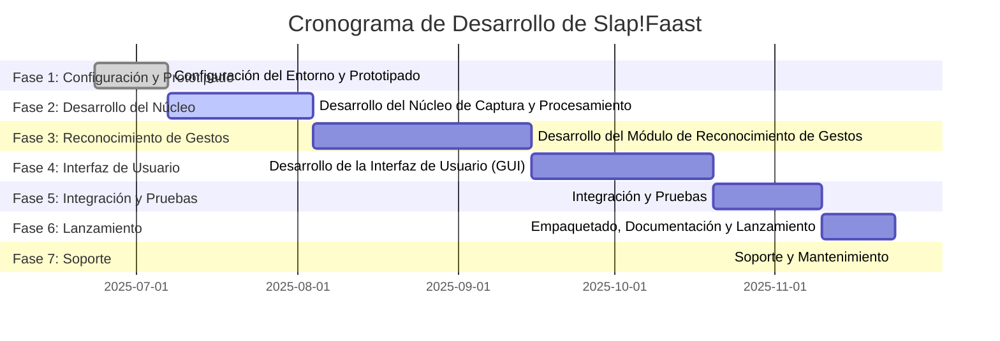

# Documentación Técnica de Slap!Faast

## Versión: 1.0
## Fecha: 22 de junio de 2025
## Autor: Manus AI

## Resumen Ejecutivo

Este documento detalla la planificación y el diseño técnico del software **Slap!Faast**, una aplicación para Windows 11 que permitirá a los usuarios controlar su sistema operativo mediante gestos utilizando sensores Kinect. El proyecto busca ofrecer compatibilidad con los modelos Kinect v1 (modelo 1414), Kinect v2 y Azure Kinect DK, proporcionando una solución flexible y personalizable para la interacción gestual. El enfoque principal de Slap!Faast es capacitar a los usuarios para definir, entrenar y mapear sus propios gestos a una amplia gama de acciones del sistema operativo, mejorando la accesibilidad y la eficiencia en el uso del PC.


## 1. Resumen de la Planificación Existente


El objetivo principal del proyecto es desarrollar un programa para Windows 11 que permita a los usuarios controlar su PC mediante gestos utilizando un Kinect v1 (modelo 1414). La idea central es ofrecer un control total del dispositivo y la capacidad de crear y personalizar gestos.

### Puntos Clave y Decisiones:

1.  **Viabilidad del Proyecto**: Se considera viable y realista, aunque requiere trabajo técnico. Se menciona que existen librerías para Kinect 360, aunque algunas son anticuadas, y se necesitará integración manual para traducir gestos en acciones del sistema.

2.  **Tecnologías Sugeridas (Python)**:
    *   **Librerías para Kinect**: `pykinect`, `OpenNI2 + NiTE2`, `libfreenect`. Se sugiere `OpenNI2 + NiTE2` como la opción más estable para el seguimiento corporal.
    *   **Reconocimiento de Gestos**: `MediaPipe` o un modelo de Machine Learning (ML) para flexibilidad y personalización.
    *   **Control del Sistema Operativo**: `pyautogui`, `keyboard`, `win32gui` para emular acciones del sistema.
    *   **Interfaz Gráfica (GUI)**: `Tkinter`, `PyQt` o `Electron` para una interfaz de usuario.

3.  **Concepto de Gestos**: Se busca que los gestos sean evidentes y no interfieran con movimientos cotidianos, evitando falsos positivos. Se propone la idea de un programa que permita al usuario diseñar y entrenar sus propios gestos, asociándolos a acciones específicas del sistema operativo.

4.  **Fase de Investigación Previa al Desarrollo**: Se propone una investigación estructurada en cuatro bloques:
    *   **Tecnologías Base y Soporte Actual**: Identificar librerías funcionales, drivers para Windows 11 y frameworks de reconocimiento de gestos.
    *   **Reconocimiento de Gestos Personalizado**: Determinar el mejor enfoque (esqueletos vs. IA), puntos clave del cuerpo y métodos para gestos dinámicos.
    *   **Mapeo de Gestos a Acciones del SO**: Cómo ejecutar acciones del sistema desde Python/C# y cómo implementar un "modo escucha" para evitar interferencias.
    *   **Interfaz Visual y Lógica de Entrenamiento**: Diseñar la GUI para ver gestos, entrenar gestos propios y asociarlos a comandos.

### Información Faltante y Áreas a Investigar:

*   **Compatibilidad Específica de Drivers**: Aunque se menciona la necesidad de investigar los drivers para Windows 11, no se especifica si hay desafíos conocidos o soluciones particulares para el Kinect v1 en esta versión del SO.
*   **Estado Actual de las Librerías**: Se menciona que algunas librerías son "algo anticuadas". Es crucial investigar el estado actual de mantenimiento y la comunidad de soporte para `pykinect`, `OpenNI2 + NiTE2`, y `libfreenect` en 2025.
*   **Rendimiento y Latencia**: No se aborda explícitamente el rendimiento esperado del sistema de reconocimiento de gestos y la latencia en la ejecución de acciones, lo cual es vital para una buena experiencia de usuario.
*   **Persistencia de Gestos Personalizados**: Cómo se almacenarán y cargarán los gestos personalizados creados por el usuario.
*   **Manejo de Errores y Excepciones**: No se menciona cómo el software manejará errores de conexión del Kinect, fallos en el reconocimiento de gestos, o conflictos con otras aplicaciones.
*   **Seguridad y Privacidad**: Consideraciones sobre la seguridad al permitir que un programa controle el sistema operativo y la privacidad de los datos de movimiento capturados por el Kinect.
*   **Alternativas a Python**: Aunque se sugiere Python, se menciona brevemente Node.js o C# con WPF. Sería útil una justificación más profunda si se descartan estas opciones o si se consideran para partes específicas del proyecto.

Esta planificación inicial proporciona una base sólida, y la fase de investigación propuesta es fundamental para abordar las incertidumbres y refinar el diseño del software.


## 2. Investigación Técnica del Kinect v1


### 2.1. Soporte de Kinect v1 (Modelo 1414) en Windows 11

El Kinect v1, originalmente diseñado para Xbox 360 y posteriormente con soporte oficial para Windows hasta Windows 10 a través del *Kinect for Windows SDK v1.8*, no cuenta con soporte oficial directo ni controladores específicos para Windows 11 por parte de Microsoft. La compañía ha descontinuado el desarrollo y soporte para esta versión del sensor.

Sin embargo, la comunidad de usuarios ha encontrado **soluciones y métodos alternativos** para hacerlo funcionar en Windows 11. Estos métodos generalmente implican:

*   **Instalación del *Kinect for Windows SDK v1.8***: Aunque está diseñado para versiones anteriores de Windows, este SDK incluye los controladores necesarios que, con ajustes, pueden ser reconocidos por Windows 11.
*   **Actualización Manual de Controladores**: En muchos casos, es necesario acceder al Administrador de Dispositivos de Windows 11 y actualizar manualmente los controladores del Kinect, seleccionando los que vienen con el SDK v1.8.
*   **Deshabilitar la Integridad de Memoria**: Algunos usuarios han reportado que la función de "Integridad de Memoria" en la Seguridad de Windows 11 puede interferir con el funcionamiento del Kinect. Deshabilitarla (bajo `Seguridad de Windows > Seguridad del dispositivo > Aislamiento del núcleo`) ha resuelto problemas para algunos.

**Conclusión sobre el soporte**: Es posible hacer funcionar el Kinect v1 en Windows 11, pero requiere pasos manuales y no hay garantía de estabilidad total debido a la falta de soporte oficial. La solución dependerá en gran medida de la persistencia del usuario y de la configuración específica de su sistema.

### 2.2. Librerías para Interacción con Kinect v1 en Python

La planificación inicial sugirió varias librerías para interactuar con el Kinect v1 en Python. A continuación, se detalla el estado actual y la compatibilidad con Windows 11 y Python:

#### a) `libfreenect`

*   **Descripción**: `libfreenect` es una librería de código abierto que proporciona una interfaz de bajo nivel para el sensor Kinect. Permite acceder a los datos de profundidad, color y audio directamente desde el hardware.
*   **Compatibilidad con Windows 11 y Python**: El repositorio oficial de `libfreenect` en GitHub indica soporte para Windows y Python. Sin embargo, se han reportado **problemas de compilación en Windows 10 y 11**, particularmente relacionados con la gestión de hilos (`pthreads`). Esto sugiere que la instalación y configuración en un entorno Windows moderno puede ser compleja y requerir conocimientos avanzados de compilación y resolución de dependencias. Existen bindings de Python (`pylibfreenect`), pero su instalación también puede ser desafiante debido a las dependencias de compilación.
*   **Estado Actual**: El proyecto parece tener actividad, pero la instalación en Windows puede ser un obstáculo significativo para usuarios no técnicos.

#### b) `OpenNI2` y `NiTE2`

*   **Descripción**: `OpenNI` (Open Natural Interaction) es un framework multiplataforma para el desarrollo de aplicaciones de interacción natural. `NiTE` (Natural Interaction Technologies) es un middleware construido sobre OpenNI que proporciona funcionalidades avanzadas como el seguimiento de esqueletos y el reconocimiento de gestos. `OpenNI2` es la segunda generación del framework.
*   **Compatibilidad con Windows 11 y Python**: Existen bindings de Python para `OpenNI2` y `NiTE2` (por ejemplo, el paquete `openni` en PyPI). Sin embargo, estos bindings requieren que `OpenNI2` y `NiTE2` estén instalados previamente en el sistema. La instalación de `OpenNI2` y `NiTE2` en Windows 11 puede ser problemática, ya que los proyectos originales fueron descontinuados por PrimeSense (adquirida por Apple). Aunque hay versiones comunitarias y forks, encontrar binarios estables y actualizados para Windows 11 puede ser difícil. La mayoría de las referencias a la instalación son de hace varios años, lo que indica una falta de soporte activo para las versiones más recientes de Windows.
*   **Estado Actual**: Aunque potentes para el seguimiento de esqueletos, la dificultad de instalación y la falta de soporte activo para Windows 11 hacen que esta opción sea menos atractiva para un proyecto que busca facilidad de uso.

#### c) `pykinect`

*   **Descripción**: `pykinect` es un binding de Python para el *Kinect for Windows SDK* de Microsoft. Permite acceder a las funcionalidades del Kinect v1 de manera más sencilla desde Python, aprovechando los controladores y la API oficial (aunque descontinuada).
*   **Compatibilidad con Windows 11 y Python**: `pykinect` depende directamente del *Kinect for Windows SDK v1.8*. Si el SDK puede instalarse y los controladores pueden forzarse a funcionar en Windows 11 (como se mencionó en la sección de soporte), entonces `pykinect` debería ser funcional. Sin embargo, al ser un binding de un SDK descontinuado, no recibirá actualizaciones para abordar problemas específicos de Windows 11 o nuevas versiones de Python. La compatibilidad puede ser variable y depender de la configuración del sistema.
*   **Estado Actual**: Es una opción viable si el SDK v1.8 se puede instalar y configurar correctamente en Windows 11, pero su futuro está limitado por la descontinuación del SDK subyacente.

### 2.3. Drivers de Kinect para Windows 11

Como se mencionó, no existen drivers oficiales de Microsoft específicos para Kinect v1 en Windows 11. La solución principal es utilizar los drivers incluidos en el **Kinect for Windows SDK v1.8** y, si es necesario, instalarlos manualmente a través del Administrador de Dispositivos. Es fundamental que el usuario se asegure de que el Kinect esté conectado a un puerto USB 2.0 (para el Kinect v1) y que la alimentación externa esté correctamente conectada.

### 2.4. Frameworks para Reconocimiento de Gestos

*   **MediaPipe**: Es una librería de Google de código abierto para construir pipelines de procesamiento de datos de percepción. Ofrece soluciones pre-entrenadas para detección de manos, seguimiento de esqueletos (Pose), y reconocimiento facial. Aunque no es nativa para Kinect, se podría alimentar con el stream de video del Kinect y utilizar sus modelos para el reconocimiento de gestos. Esto requeriría un paso intermedio para obtener el stream de video del Kinect y pasarlo a MediaPipe. Es una opción muy potente y activa en desarrollo.
*   **NiTE2**: Como se mencionó, `NiTE2` es un middleware para `OpenNI2` que ofrece seguimiento de esqueletos y reconocimiento de gestos. Si se logra instalar `OpenNI2` y `NiTE2`, esta sería una opción directa para el reconocimiento de gestos basado en esqueletos.

**Recomendación Preliminar**: Dada la dificultad de instalación de `libfreenect` y `OpenNI2/NiTE2` en Windows 11, y la dependencia de `pykinect` de un SDK descontinuado, se sugiere explorar la viabilidad de utilizar **MediaPipe** para el reconocimiento de gestos. Esto implicaría obtener el stream de video del Kinect a través de una de las librerías mencionadas (la que resulte más fácil de instalar y estable) y luego procesar ese stream con MediaPipe. Esta aproximación podría ofrecer mayor flexibilidad y acceso a modelos de reconocimiento de gestos más modernos y mantenidos activamente.

**Próximos Pasos**: La siguiente fase de investigación debería centrarse en la viabilidad de obtener el stream de video del Kinect v1 en Windows 11 de la manera más sencilla posible para poder alimentarlo a MediaPipe, o en identificar una librería de bajo nivel que, aunque compleja de instalar, ofrezca la mayor estabilidad para la captura de datos del sensor.

### 2.5. Puntos Clave del Cuerpo (Joints) que Ofrece el Kinect 360 v1

El Kinect v1 (modelo 1414) es capaz de rastrear hasta 20 puntos clave (joints) del esqueleto humano para cada usuario detectado (hasta dos usuarios simultáneamente en modo de seguimiento completo). Estos puntos son fundamentales para el reconocimiento de posturas y gestos. Los 20 joints rastreados por el Kinect v1 son:

1.  **HipCenter** (Centro de la Cadera)
2.  **Spine** (Columna Vertebral - base)
3.  **ShoulderCenter** (Centro de los Hombros)
4.  **Head** (Cabeza)
5.  **ShoulderLeft** (Hombro Izquierdo)
6.  **ElbowLeft** (Codo Izquierdo)
7.  **WristLeft** (Muñeca Izquierda)
8.  **HandLeft** (Mano Izquierda)
9.  **ShoulderRight** (Hombro Derecho)
10. **ElbowRight** (Codo Derecho)
11. **WristRight** (Muñeca Derecha)
12. **HandRight** (Mano Derecha)
13. **HipLeft** (Cadera Izquierda)
14. **KneeLeft** (Rodilla Izquierda)
15. **AnkleLeft** (Tobillo Izquierdo)
16. **FootLeft** (Pie Izquierdo)
17. **HipRight** (Cadera Derecha)
18. **KneeRight** (Rodilla Derecha)
19. **AnkleRight** (Tobillo Derecho)
20. **FootRight** (Pie Derecho)

Estos joints proporcionan la información espacial (coordenadas X, Y, Z) necesaria para reconstruir la pose del usuario en 3D, lo que permite la detección de movimientos y gestos complejos. La precisión de este seguimiento es crucial para la efectividad del sistema de reconocimiento de gestos.


## 3. Análisis de Tecnologías y Herramientas de Desarrollo para Kinect v1


### 3.1. Enfoques para el Reconocimiento de Gestos Personalizado

Para el reconocimiento de gestos con el Kinect v1, existen dos enfoques principales que se pueden considerar, cada uno con sus ventajas y desventajas:

#### 1. Reconocimiento Basado en Seguimiento de Esqueletos (Rule-based)

Este enfoque se basa en el análisis de los datos de los 20 puntos clave (joints) del esqueleto humano que el Kinect v1 proporciona. Los gestos se definen mediante un conjunto de reglas lógicas que evalúan la posición relativa, la velocidad, la aceleración y los ángulos entre diferentes joints a lo largo del tiempo.

*   **Cómo funciona**: Se monitorean las coordenadas 3D de los joints (por ejemplo, manos, codos, hombros) y se aplican algoritmos para detectar patrones de movimiento específicos. Por ejemplo, un gesto de "deslizar la mano hacia la izquierda" podría detectarse si la coordenada X de la mano izquierda se mueve significativamente hacia la izquierda mientras la mano está extendida y luego regresa a una posición neutral.
*   **Ventajas**:
    *   **Directo y Nativo**: Utiliza la capacidad principal del Kinect v1 para el seguimiento de esqueletos.
    *   **Menos Complejidad de Implementación Inicial**: Para gestos simples y predefinidos, puede ser más sencillo de codificar con lógica condicional.
    *   **Transparencia**: Las reglas son explícitas y fáciles de entender y depurar.
*   **Desventajas**:
    *   **Rigidez**: Puede ser difícil adaptar el sistema a variaciones naturales en la forma en que las personas realizan los gestos. Pequeñas diferencias en el estilo o la velocidad pueden hacer que un gesto no sea reconocido.
    *   **Escalabilidad Limitada**: A medida que aumenta el número de gestos o su complejidad, el conjunto de reglas puede volverse muy grande y difícil de mantener.
    *   **Dificultad para Gestos Sutiles**: Los gestos que no implican grandes movimientos de los joints pueden ser difíciles de detectar con precisión.

#### 2. Reconocimiento Basado en Visión por IA (Machine Learning)

Este enfoque utiliza técnicas de aprendizaje automático (Machine Learning), como redes neuronales convolucionales (CNNs) o redes recurrentes (RNNs), para aprender a reconocer gestos a partir de los datos del Kinect (ya sean imágenes de profundidad, imágenes RGB o los propios datos de los joints del esqueleto).

*   **Cómo funciona**: Se recopila un conjunto de datos de ejemplos de gestos (realizados por diferentes personas, en diferentes condiciones) y se utiliza para entrenar un modelo de IA. El modelo aprende a identificar patrones complejos en los datos que corresponden a gestos específicos. Librerías como MediaPipe pueden proporcionar modelos pre-entrenados o facilitar el entrenamiento de modelos personalizados.
*   **Ventajas**:
    *   **Flexibilidad y Adaptabilidad**: Puede reconocer gestos más complejos y sutiles, y es más tolerante a las variaciones en la ejecución del gesto.
    *   **Personalización Avanzada**: Permite a los usuarios "entrenar" sus propios gestos, ya que el modelo puede aprender de nuevos ejemplos.
    *   **Escalabilidad**: Puede manejar un gran número de gestos y nuevas incorporaciones sin una reescritura masiva de reglas.
*   **Desventajas**:
    *   **Complejidad de Implementación**: Requiere conocimientos de Machine Learning, recopilación y etiquetado de datos, y entrenamiento de modelos.
    *   **Recursos Computacionales**: El procesamiento y la inferencia de modelos de IA pueden requerir más recursos de CPU/GPU.
    *   **Dependencia de Datos**: La calidad y cantidad de los datos de entrenamiento son cruciales para el rendimiento del modelo.

#### Recomendación y Enfoque Híbrido

Dado el objetivo de permitir a los usuarios diseñar sus propios gestos, el **reconocimiento basado en Visión por IA (Machine Learning)** es el enfoque más adecuado y prometedor. Proporciona la flexibilidad y personalización necesarias para un sistema de entrenamiento de gestos.

Sin embargo, un **enfoque híbrido** podría ser el más robusto:

*   **Capa de Bajo Nivel (Skeletal Tracking)**: Utilizar los datos de seguimiento de esqueletos del Kinect como entrada principal para el sistema.
*   **Capa de Alto Nivel (IA/ML)**: Aplicar modelos de Machine Learning (posiblemente con la ayuda de librerías como MediaPipe, que ya procesa datos de pose) para el reconocimiento de gestos complejos y la capacidad de entrenamiento personalizado.
*   **Reglas Simples para Activación/Modo Escucha**: Para evitar falsos positivos, se podrían usar reglas simples basadas en el seguimiento de esqueletos para activar el "modo escucha" del sistema de gestos (por ejemplo, levantar una mano específica o una postura inicial), lo que reduciría la necesidad de que el modelo de IA esté siempre activo y procesando, y permitiría gestos más evidentes como los que el usuario sugirió (movimientos de "cachetada" o muñeca).

Este enfoque híbrido permitiría aprovechar la precisión del seguimiento de esqueletos del Kinect y la flexibilidad del Machine Learning para el reconocimiento de gestos personalizados, al tiempo que se gestiona la complejidad y el rendimiento.

### 3.2. Métodos para Detectar Gestos Dinámicos

La detección de gestos dinámicos, aquellos que implican una secuencia de movimientos a lo largo del tiempo, es más compleja que la detección de poses estáticas. Para el Kinect v1, los métodos comunes se basan en el análisis de la evolución de las posiciones de los joints del esqueleto a lo largo de varios fotogramas. Algunos de los enfoques más relevantes incluyen:

1.  **Dynamic Time Warping (DTW)**:
    *   **Descripción**: DTW es un algoritmo que mide la similitud entre dos secuencias de tiempo que pueden variar en velocidad. Es muy útil para comparar una secuencia de movimiento realizada por el usuario con una plantilla de gesto predefinida, incluso si el gesto se realiza a diferentes velocidades.
    *   **Aplicación con Kinect**: Se puede aplicar DTW a las secuencias de coordenadas de los joints del esqueleto. Por ejemplo, para un gesto de "saludo", se grabaría una secuencia de joints de referencia, y luego se compararía la secuencia de movimiento del usuario con esta referencia usando DTW para determinar si el gesto coincide.
    *   **Ventajas**: Robusto a variaciones de velocidad y duración del gesto. Relativamente fácil de implementar para un número limitado de gestos.
    *   **Desventajas**: Puede ser computacionalmente intensivo para un gran número de plantillas de gestos. Requiere la creación de plantillas de referencia para cada gesto.

2.  **Hidden Markov Models (HMMs)**:
    *   **Descripción**: Los HMMs son modelos estadísticos que se utilizan para modelar secuencias de eventos. En el contexto de los gestos, cada estado del HMM podría representar una fase del gesto, y las transiciones entre estados modelarían la progresión del movimiento.
    *   **Aplicación con Kinect**: Los datos de los joints del esqueleto se pueden usar como observaciones para entrenar un HMM para cada gesto. Una vez entrenados, los HMMs pueden clasificar nuevas secuencias de movimiento.
    *   **Ventajas**: Capaces de modelar la variabilidad temporal y espacial de los gestos. Buenos para el reconocimiento continuo de gestos.
    *   **Desventajas**: Requieren una cantidad significativa de datos de entrenamiento. La interpretación y depuración pueden ser más complejas que con DTW.

3.  **Redes Neuronales Recurrentes (RNNs) y LSTMs/GRUs**:
    *   **Descripción**: Las RNNs, y en particular sus variantes como las Long Short-Term Memory (LSTM) o Gated Recurrent Unit (GRU), son arquitecturas de redes neuronales diseñadas específicamente para procesar secuencias de datos. Son excelentes para capturar dependencias a largo plazo en los datos temporales.
    *   **Aplicación con Kinect**: Las secuencias de coordenadas de los joints del esqueleto a lo largo del tiempo se pueden introducir directamente en una red LSTM/GRU. La red aprendería a clasificar el gesto basándose en la evolución de la pose.
    *   **Ventajas**: Muy potentes para el reconocimiento de patrones complejos en secuencias. No requieren la definición explícita de reglas o plantillas.
    *   **Desventajas**: Requieren grandes conjuntos de datos para un entrenamiento efectivo. Son computacionalmente intensivas y pueden necesitar hardware especializado (GPU) para el entrenamiento y la inferencia en tiempo real.

4.  **Clasificadores Basados en Características (Feature-based Classifiers)**:
    *   **Descripción**: Este enfoque implica extraer características relevantes de la secuencia de movimiento (por ejemplo, velocidad promedio de la mano, distancia máxima entre dos joints, duración del movimiento) y luego usar clasificadores tradicionales de Machine Learning (como Support Vector Machines - SVM, Random Forests) para clasificar el gesto.
    *   **Aplicación con Kinect**: Se calculan las características a partir de los datos de los joints del esqueleto y se utilizan para entrenar el clasificador.
    *   **Ventajas**: Puede ser más eficiente computacionalmente que las redes neuronales profundas. Las características pueden ser interpretables.
    *   **Desventajas**: La selección de características es crucial y puede ser un proceso manual y tedioso. Menos flexible para gestos muy complejos.

**Consideraciones para Slap!Faast**:

Dado el objetivo de permitir a los usuarios **diseñar y entrenar sus propios gestos**, los métodos basados en **Machine Learning (RNNs/LSTMs)** o **DTW** son los más adecuados. DTW podría ser una buena opción inicial por su relativa simplicidad y robustez a la variabilidad de velocidad, mientras que las RNNs/LSTMs ofrecerían mayor flexibilidad y capacidad de generalización para gestos más complejos y un sistema de entrenamiento más avanzado. Un enfoque híbrido, donde DTW se use para gestos simples y un modelo de ML para gestos más complejos o personalizados, podría ser óptimo.

### 3.3. Librerías para Mapear Gestos a Acciones del Sistema Operativo

Para que Slap!Faast pueda traducir los gestos reconocidos en acciones concretas dentro del sistema operativo Windows, se necesitarán librerías que permitan la emulación de entradas de usuario (teclado, ratón) y la interacción con ventanas y procesos. Las librerías sugeridas en la planificación inicial son `pyautogui`, `keyboard` y `win32gui`.

1.  **`pyautogui`**:
    *   **Descripción**: `pyautogui` es una librería de Python multiplataforma que permite controlar el ratón y el teclado, así como realizar automatización de la interfaz gráfica de usuario (GUI). Es muy útil para simular interacciones humanas con el sistema operativo.
    *   **Funcionalidades Clave**: Puede mover el ratón, hacer clics, escribir texto, presionar teclas (individuales o combinaciones como `Win + Tab`), tomar capturas de pantalla y encontrar imágenes en la pantalla.
    *   **Ventajas**: Fácil de usar, bien documentada y compatible con Windows. Ideal para la mayoría de las acciones de emulación de teclado y ratón.
    *   **Desventajas**: Puede ser susceptible a cambios en la resolución de pantalla o la posición de los elementos de la GUI si se usa para automatización visual (aunque para atajos de teclado y ratón es muy robusta). No está diseñada para interactuar directamente con la API de Windows a un nivel más profundo.

2.  **`keyboard`**:
    *   **Descripción**: La librería `keyboard` permite controlar y monitorear el teclado. Es una librería de bajo nivel que puede simular pulsaciones de teclas y registrar eventos de teclado.
    *   **Funcionalidades Clave**: `keyboard.press()`, `keyboard.release()`, `keyboard.send()`, `keyboard.add_hotkey()`, `keyboard.record()`, `keyboard.play()`.
    *   **Ventajas**: Muy eficiente para la emulación de teclado. Puede ser útil para crear atajos de teclado personalizados o para simular secuencias de teclas complejas.
    *   **Desventajas**: Principalmente enfocada en el teclado, no maneja el ratón ni la interacción con ventanas de forma nativa.

3.  **`win32gui` (parte de `pywin32`)**:
    *   **Descripción**: `pywin32` es un conjunto de extensiones de Python para Windows que proporciona acceso a gran parte de la API de Windows. `win32gui` específicamente permite interactuar con elementos de la GUI de Windows, como ventanas, botones, etc.
    *   **Funcionalidades Clave**: Permite encontrar ventanas por título o clase, activar ventanas, moverlas, redimensionarlas, minimizar, maximizar, cerrar, y enviar mensajes a los controles de la ventana.
    *   **Ventajas**: Ofrece un control más granular sobre las ventanas y procesos de Windows que `pyautogui`. Permite interactuar con aplicaciones de forma más robusta que la simple emulación de teclado/ratón.
    *   **Desventajas**: Específica de Windows. La curva de aprendizaje puede ser más pronunciada debido a la complejidad de la API de Windows.

**Recomendación para Slap!Faast**: Se recomienda utilizar una combinación de estas librerías:

*   **`pyautogui`**: Para la mayoría de las acciones de emulación de teclado y ratón (ej. `Win + Tab`, `Ctrl + -`, subir/bajar volumen).
*   **`win32gui`**: Para interacciones más avanzadas con ventanas (ej. activar una aplicación específica, mover una ventana a un monitor diferente, cerrar una ventana).
*   **`keyboard`**: Podría ser una alternativa a `pyautogui` para la emulación de teclado, o complementaria si se necesitan funcionalidades muy específicas de monitoreo de teclado. Sin embargo, `pyautogui` ya cubre la mayoría de las necesidades de emulación de teclado para este proyecto.

La elección final dependerá de la complejidad de las acciones que se deseen mapear y del nivel de control requerido sobre el sistema operativo.

### 3.4. Captura de Gestos en Segundo Plano y Concepto de "Modo Escucha"

Para que **Slap!Faast** sea una herramienta útil y no intrusiva, es fundamental que el reconocimiento de gestos pueda operar en segundo plano sin interferir con el uso normal del sistema operativo. Además, la implementación de un "modo escucha" es crucial para evitar falsos positivos y permitir que el usuario active o desactive el reconocimiento de gestos a voluntad.

**1. Operación en Segundo Plano:**

*   **Procesos Separados/Hilos (Threading)**: La forma más común de lograr la operación en segundo plano en Python es mediante el uso de hilos (`threading` module) o procesos (`multiprocessing` module). El módulo principal de la aplicación (la GUI, si existe) se ejecutaría en un hilo, mientras que la captura de datos del Kinect, el procesamiento de esqueletos y el reconocimiento de gestos se ejecutarían en otro hilo o proceso separado. Esto evita que la interfaz de usuario se congele mientras se realiza el procesamiento intensivo.
*   **Servicio de Windows**: Para una integración más profunda y una ejecución persistente incluso sin una interfaz de usuario activa, el componente de reconocimiento de gestos podría implementarse como un servicio de Windows. Esto permitiría que el programa se inicie automáticamente con el sistema y opere en segundo plano de manera continua.
*   **Comunicación entre Componentes**: Se necesitarán mecanismos de comunicación entre el hilo/proceso de reconocimiento de gestos y el hilo/proceso que ejecuta las acciones del sistema operativo (por ejemplo, colas de mensajes, eventos, pipes). Cuando se detecta un gesto, se enviaría una señal o un mensaje al componente de ejecución de acciones.

**2. Concepto de "Modo Escucha" (Activation/Deactivation):**

El "modo escucha" es una característica esencial para controlar cuándo el sistema de reconocimiento de gestos está activo y cuándo no. Esto previene activaciones accidentales y permite al usuario tener control sobre la interacción.

*   **Gesto de Activación/Desactivación**: Un gesto específico y muy distintivo (como el "golpe de cachetada" o un movimiento de muñeca propuesto por el usuario) podría usarse para alternar entre el modo "escucha activa" y el modo "inactivo". Cuando el sistema está inactivo, el Kinect podría seguir capturando datos, pero el algoritmo de reconocimiento de gestos estaría pausado o ignoraría los movimientos.
*   **Atajo de Teclado/Ratón**: Además de un gesto, se podría implementar un atajo de teclado o un clic de ratón específico (por ejemplo, en un icono de la bandeja del sistema) para activar/desactivar el modo escucha. Esto proporciona una forma alternativa de control si el usuario no puede o no desea realizar el gesto de activación.
*   **Interfaz de Usuario (GUI)**: La GUI de Slap!Faast debería tener un indicador visual claro del estado actual del "modo escucha" (activo/inactivo) y un botón para alternar este estado.
*   **Zonas de Interacción**: Se podría definir una "zona de interacción" frente al Kinect. Solo los gestos realizados dentro de esta zona serían considerados para el reconocimiento, ignorando movimientos fuera de ella. Esto ayuda a filtrar movimientos no intencionados.

**Flujo Básico del "Modo Escucha":**

1.  **Inicio**: El programa se inicia en modo "inactivo" o "escucha pasiva". El Kinect está encendido y capturando datos, pero el reconocimiento de gestos estaría deshabilitado.
2.  **Activación**: El usuario realiza el gesto de activación (o usa el atajo de teclado/ratón). El sistema pasa a modo "escucha activa".
3.  **Reconocimiento**: En modo "escucha activa", el algoritmo de reconocimiento de gestos procesa los datos del Kinect. Si se detecta un gesto válido, se ejecuta la acción asociada.
4.  **Desactivación**: El usuario realiza el gesto de desactivación (o usa el atajo de teclado/ratón). El sistema vuelve a modo "inactivo" o "escucha pasiva".

La implementación de estos conceptos garantizará que Slap!Faast sea una herramienta eficiente, precisa y amigable para el usuario.


## 4. Investigación Técnica y de Compatibilidad para Kinect v2 y Azure Kinect


### 4.1. Kinect v2 (para Xbox One y Kinect for Windows v2)

El Kinect v2, lanzado inicialmente con la Xbox One y posteriormente como "Kinect for Windows v2", representa una mejora significativa sobre el Kinect v1 en términos de precisión, campo de visión y capacidades de seguimiento. Utiliza el **Kinect for Windows SDK 2.0**.

*   **Soporte en Windows 11**: Al igual que el Kinect v1, el soporte oficial para el Kinect v2 y su SDK 2.0 ha sido descontinuado por Microsoft. Sin embargo, la comunidad ha encontrado que el Kinect v2 **puede funcionar en Windows 11**, aunque no sin desafíos. Muchos usuarios reportan que el SDK 2.0, diseñado para Windows 8/8.1/10, a menudo funciona en Windows 11, pero puede haber problemas de conexión intermitente o de reconocimiento del sensor.
*   **Problemas Comunes**: Los problemas más frecuentes incluyen el sensor que no se mantiene conectado por más de unos segundos ("connection cycling"), o que Windows 11 lo reconoce solo como un dispositivo de audio. Algunos usuarios han tenido éxito deshabilitando la "Integridad de Memoria" en la configuración de seguridad de Windows 11, similar al Kinect v1.
*   **Requisitos de Hardware**: El Kinect v2 requiere un puerto USB 3.0 dedicado y un adaptador de corriente específico (que a menudo viene con el sensor o se vende por separado). La falta de un puerto USB 3.0 compatible o un adaptador de corriente defectuoso son causas comunes de problemas.
*   **Librerías y SDK**: La principal forma de interactuar con el Kinect v2 es a través del **Kinect for Windows SDK 2.0**. Este SDK proporciona APIs para acceder a los datos de color, profundidad, infrarrojos, audio y seguimiento corporal (hasta 6 personas con 25 joints por esqueleto). Existen bindings de Python para este SDK, como `pykinect2`, que permiten desarrollar aplicaciones en Python.

**Conclusión sobre Kinect v2**: Es posible usar el Kinect v2 en Windows 11, pero puede requerir solución de problemas manual y no hay garantía de un funcionamiento perfecto debido a la falta de soporte oficial. La experiencia puede variar significativamente entre diferentes configuraciones de hardware y versiones de Windows 11.

### 4.2. Azure Kinect DK

El Azure Kinect DK es el sensor más reciente de Microsoft, diseñado para desarrolladores y aplicaciones de inteligencia artificial y visión por computadora. A diferencia de sus predecesores, el Azure Kinect DK está activamente soportado por Microsoft y cuenta con un SDK moderno y en desarrollo continuo.

*   **Soporte en Windows 11**: El Azure Kinect DK está **oficialmente soportado en Windows 10 y Windows 11**. Microsoft proporciona un SDK (`Azure-Kinect-Sensor-SDK`) y un SDK de seguimiento corporal (`Azure-Kinect-Body-Tracking-SDK`) que son compatibles con Windows 11. Sin embargo, algunos usuarios han reportado problemas de conexión o reconocimiento después de ciertas actualizaciones de Windows 11, lo que sugiere que, aunque hay soporte oficial, pueden surgir incompatibilidades temporales debido a cambios en el sistema operativo.
*   **Características Mejoradas**: El Azure Kinect DK ofrece mejoras significativas en comparación con el Kinect v1 y v2, incluyendo:
    *   **Sensor de Profundidad de Tiempo de Vuelo (ToF)**: Mayor precisión y menor latencia.
    *   **Cámara RGB de Alta Resolución**: Hasta 3840x2160 (4K).
    *   **Micrófono de 7 Elementos**: Mejor captura de audio y reconocimiento de voz.
    *   **Unidad de Medición Inercial (IMU)**: Para el seguimiento de la orientación del dispositivo.
    *   **Seguimiento Corporal Avanzado**: Capaz de rastrear hasta 32 joints por persona y hasta 6 personas simultáneamente, con mayor precisión y robustez.
*   **Requisitos de Hardware**: Requiere un puerto USB 3.0 y una GPU compatible (NVIDIA o AMD) para el seguimiento corporal, ya que el procesamiento es intensivo.
*   **Librerías y SDK**: Microsoft proporciona SDKs oficiales para C++, C# y Python (a través de bindings). El `Azure-Kinect-Sensor-SDK` permite acceder a los datos brutos del sensor, mientras que el `Azure-Kinect-Body-Tracking-SDK` se encarga del seguimiento de esqueletos.

**Conclusión sobre Azure Kinect DK**: Es la opción más robusta y recomendada para nuevos desarrollos, ya que cuenta con soporte oficial y un hardware superior. Aunque pueden surgir problemas puntuales con actualizaciones de Windows, la compatibilidad general es mucho mejor que con los modelos anteriores de Kinect.

### 4.3. Consideraciones para un Software Multi-Kinect (Slap!Faast)

Integrar el soporte para Kinect v1, Kinect v2 y Azure Kinect en un solo programa como Slap!Faast presenta desafíos y oportunidades:

*   **Abstracción de Hardware**: Será crucial diseñar una capa de abstracción que permita al resto del programa interactuar con los datos del sensor (imágenes de profundidad, RGB, datos de esqueleto) de manera uniforme, independientemente del modelo de Kinect utilizado. Esto implicaría crear interfaces comunes para la captura de datos y el seguimiento de esqueletos.
*   **Diferencias en los Datos de Esqueleto**: Aunque todos los Kinects proporcionan datos de esqueleto, el número y la denominación de los joints pueden variar (20 para v1, 25 para v2, 32 para Azure Kinect). El sistema de reconocimiento de gestos deberá ser lo suficientemente flexible para manejar estas diferencias o normalizar los datos a un conjunto común de joints.
*   **Requisitos de Instalación y Dependencias**: Cada modelo de Kinect tiene sus propios drivers y SDKs. El instalador de Slap!Faast o el proceso de configuración inicial deberá guiar al usuario para instalar los componentes correctos según el modelo de Kinect que posea.
*   **Rendimiento**: El rendimiento del reconocimiento de gestos y la ejecución de acciones variará significativamente entre los modelos de Kinect. El Azure Kinect DK ofrecerá la mejor experiencia, mientras que el Kinect v1 será el más limitado. El software deberá ser consciente de estas limitaciones y posiblemente ajustar la complejidad de los gestos o la frecuencia de reconocimiento.
*   **Priorización**: Dado que el Azure Kinect DK es el más moderno y soportado, el desarrollo principal de las funcionalidades de reconocimiento de gestos y personalización debería centrarse en aprovechar al máximo sus capacidades, mientras que el soporte para Kinect v1 y v2 se manejaría como una capa de compatibilidad, posiblemente con un conjunto de características más limitado o con un rendimiento inferior.

La implementación de un sistema multi-Kinect requerirá una arquitectura modular y flexible para adaptarse a las diferentes capacidades y requisitos de cada sensor.

### 4.4. Librerías y SDKs para Kinect v2 y Azure Kinect en Python

Para interactuar con el Kinect v2 y el Azure Kinect DK desde Python, se utilizan diferentes SDKs y librerías, reflejando la evolución de la tecnología de Microsoft.

#### a) Kinect v2 (Kinect for Windows v2)

*   **SDK Principal**: El **Kinect for Windows SDK 2.0** es el SDK oficial de Microsoft para el Kinect v2. Proporciona las APIs nativas (C++, C#) para acceder a todos los flujos de datos del sensor y al seguimiento corporal.
*   **Librería Python**: **`PyKinect2`** es el wrapper de Python más comúnmente utilizado para el Kinect for Windows SDK 2.0. Permite a los desarrolladores de Python acceder a las funcionalidades del Kinect v2, incluyendo:
    *   Captura de datos de color, profundidad, infrarrojos.
    *   Seguimiento de esqueletos (25 joints por persona, hasta 6 personas).
    *   Acceso a datos de audio.
    *   Reconocimiento facial y de gestos (si se utilizan las funcionalidades del SDK).
*   **Dependencias**: Para usar `PyKinect2`, es necesario tener instalado el Kinect for Windows SDK 2.0 en el sistema. Esto implica que los desafíos de compatibilidad del SDK con Windows 11 (mencionados anteriormente) también afectarán a `PyKinect2`.

#### b) Azure Kinect DK

*   **SDKs Principales**: Microsoft proporciona dos SDKs principales para el Azure Kinect DK:
    *   **Azure-Kinect-Sensor-SDK**: Permite acceder a los datos brutos de los sensores (cámara de profundidad, cámara RGB, micrófono, IMU).
    *   **Azure-Kinect-Body-Tracking-SDK**: Construido sobre el Sensor SDK, proporciona capacidades avanzadas de seguimiento de esqueletos (hasta 32 joints por persona, hasta 6 personas) y requiere una GPU compatible para su funcionamiento.
*   **Librerías Python**: Existen varias librerías de Python que actúan como wrappers para los SDKs de Azure Kinect, facilitando su uso en entornos Python. Las más destacadas son:
    *   **`pyk4a`**: Un wrapper simple y "pythónico" para el Azure-Kinect-Sensor-SDK. Devuelve las imágenes como arrays de NumPy, lo que facilita la integración con librerías de procesamiento de imágenes y Machine Learning en Python.
    *   **`pyKinectAzure`**: Otra librería de Python que envuelve el Kinect Azure SDK, proporcionando acceso a los datos del sensor y al seguimiento corporal. Ofrece ejemplos y una estructura clara para trabajar con el dispositivo.
    *   **`KinZ-Python`**: Una librería que permite usar Azure Kinect directamente en Python, con un enfoque en la facilidad de instalación y uso.
*   **Dependencias**: Para usar estas librerías de Python, es necesario tener instalados los SDKs de Azure Kinect (Sensor SDK y, si se usa el seguimiento corporal, el Body Tracking SDK) en el sistema. El Body Tracking SDK requiere una GPU compatible (NVIDIA o AMD) y sus respectivos drivers actualizados.

**Consideraciones para Slap!Faast**: La elección de la librería Python dependerá de la profundidad de control requerida y la facilidad de integración. Para el Kinect v2, `PyKinect2` es la opción obvia. Para Azure Kinect, `pyk4a` o `pyKinectAzure` parecen ser buenas opciones debido a su enfoque en la integración con el ecosistema Python y NumPy, lo cual es beneficioso para el procesamiento de datos y el Machine Learning. La arquitectura de Slap!Faast deberá ser lo suficientemente flexible para encapsular las diferencias entre estas librerías y presentar una interfaz unificada al módulo de reconocimiento de gestos.

### 4.5. Requisitos de Hardware y Dependencias para Kinect v2 y Azure Kinect

#### a) Kinect v2 (Kinect for Windows v2)

Para utilizar el Kinect v2 en un PC con Windows 11, se deben cumplir los siguientes requisitos de hardware y software:

*   **Sensor**: Kinect v2 (para Xbox One o Kinect for Windows v2).
*   **Adaptador**: Adaptador Kinect para Windows (necesario para conectar el sensor de Xbox One a un PC). Este adaptador convierte la conexión propietaria del Kinect v2 a USB 3.0 y proporciona alimentación.
*   **Puerto USB**: Un puerto **USB 3.0 dedicado**. Es crucial que sea un puerto USB 3.0, ya que el ancho de banda de USB 2.0 es insuficiente para los datos del Kinect v2. Algunos usuarios han reportado problemas con ciertos controladores USB 3.0 (especialmente los de Intel) en Windows 11, lo que puede requerir actualizaciones de drivers del chipset o pruebas con diferentes puertos.
*   **Procesador**: Procesador de 64 bits (x64) con al menos un **doble núcleo físico de 3.1 GHz** o superior. Se recomienda un procesador más potente para un rendimiento óptimo, especialmente si se realiza procesamiento intensivo de datos.
*   **Memoria RAM**: **4 GB de RAM** o más.
*   **Tarjeta Gráfica**: Una tarjeta gráfica compatible con DirectX 11. Se recomienda una GPU dedicada para el seguimiento corporal y el procesamiento de datos de profundidad.
*   **Sistema Operativo**: Windows 8, Windows 8.1, Windows 10 o **Windows 11 (con las consideraciones de compatibilidad mencionadas anteriormente)**.
*   **Software**: **Kinect for Windows SDK 2.0** instalado. Este SDK incluye los controladores necesarios y las bibliotecas de desarrollo.

#### b) Azure Kinect DK

El Azure Kinect DK es un dispositivo más avanzado y, por lo tanto, tiene requisitos de hardware más exigentes, especialmente para el seguimiento corporal:

*   **Sensor**: Azure Kinect DK.
*   **Puerto USB**: Un puerto **USB 3.0 dedicado**. Es fundamental para el alto ancho de banda de datos del sensor.
*   **Procesador**: Procesador de 64 bits (x64) con al menos **cuatro núcleos físicos de 2.5 GHz** o superior. Se recomienda un procesador moderno y potente para manejar el procesamiento de datos.
*   **Memoria RAM**: **8 GB de RAM** o más.
*   **Tarjeta Gráfica**: Una **GPU dedicada** es **obligatoria** para el seguimiento corporal. Se requiere una GPU compatible con CUDA (NVIDIA) o DirectML (AMD/Intel) con drivers actualizados. El procesamiento del seguimiento corporal es intensivo y se descarga a la GPU.
*   **Sistema Operativo**: Windows 10 (versión 1809 o posterior) o **Windows 11**. Soporte oficial y activo por parte de Microsoft.
*   **Software**: 
    *   **Azure-Kinect-Sensor-SDK** instalado.
    *   **Azure-Kinect-Body-Tracking-SDK** instalado (si se desea utilizar el seguimiento corporal). Este SDK requiere una GPU compatible y sus drivers.
    *   **Visual C++ Redistributable** para Visual Studio 2015, 2017, 2019, and 2022 (x64).

**Consideraciones Generales para Slap!Faast**: El programa deberá verificar los requisitos de hardware del sistema y el modelo de Kinect conectado para informar al usuario sobre posibles limitaciones de rendimiento o funcionalidades no disponibles. La instalación de los SDKs correspondientes será un paso crítico en el proceso de configuración del software.


## 5. Diseño de Arquitectura del Software Multi-Kinect: Slap!Faast


## 5. Diseño de Arquitectura del Software Multi-Kinect: Slap!Faast

### Introducción

El objetivo de **Slap!Faast** es proporcionar una solución integral para el control de gestos en Windows 11, utilizando una variedad de sensores Kinect, incluyendo el Kinect v1 (modelo 1414), Kinect v2 y Azure Kinect DK. Dada la diversidad de hardware y SDKs asociados, la arquitectura del software debe ser modular, extensible y capaz de abstraer las complejidades específicas de cada sensor, presentando una interfaz unificada al módulo de reconocimiento de gestos y al resto de la aplicación. El diseño propuesto busca maximizar la compatibilidad, el rendimiento y la facilidad de uso, al tiempo que permite la personalización de gestos por parte del usuario.

### Principios de Diseño

Para lograr los objetivos de Slap!Faast, la arquitectura se basará en los siguientes principios:

*   **Modularidad**: Dividir el sistema en componentes independientes y cohesivos, cada uno con una responsabilidad clara. Esto facilita el desarrollo, la prueba y el mantenimiento.
*   **Abstracción**: Ocultar los detalles de implementación específicos de cada modelo de Kinect detrás de interfaces comunes, permitiendo que los módulos de nivel superior interactúen con los datos del sensor de manera uniforme.
*   **Extensibilidad**: Diseñar el sistema de manera que sea fácil añadir soporte para nuevos modelos de Kinect o algoritmos de reconocimiento de gestos en el futuro.
*   **Rendimiento**: Optimizar las rutas de datos y el procesamiento para garantizar una baja latencia en el reconocimiento de gestos y la ejecución de acciones, especialmente considerando las limitaciones de hardware de los modelos más antiguos de Kinect.
*   **Robustez**: Implementar mecanismos de manejo de errores y recuperación para asegurar la estabilidad del sistema frente a desconexiones del sensor o fallos en el reconocimiento.
*   **Configurabilidad**: Permitir al usuario configurar fácilmente los gestos, las acciones asociadas y los parámetros del sistema a través de una interfaz gráfica intuitiva.

### Componentes Principales de la Arquitectura

La arquitectura de Slap!Faast se puede dividir en los siguientes componentes principales:

1.  **Módulo de Adquisición de Datos del Sensor (Sensor Data Acquisition Module)**
2.  **Módulo de Procesamiento de Esqueletos (Skeleton Processing Module)**
3.  **Módulo de Reconocimiento de Gestos (Gesture Recognition Module)**
4.  **Módulo de Ejecución de Acciones (Action Execution Module)**
5.  **Módulo de Interfaz de Usuario (User Interface Module)**
6.  **Módulo de Configuración y Persistencia (Configuration & Persistence Module)**
7.  **Módulo de Control de Aplicación (Application Control Module)**

Cada uno de estos módulos se comunicará a través de interfaces bien definidas, utilizando mecanismos de comunicación entre procesos o hilos según sea necesario para garantizar la operación en segundo plano y la capacidad de respuesta de la interfaz de usuario.

#### 5.1. Módulo de Adquisición de Datos del Sensor

Este módulo es responsable de la interacción directa con los diferentes modelos de Kinect para capturar los datos brutos. Será la capa más cercana al hardware y encapsulará las particularidades de cada SDK de Kinect.

*   **Responsabilidades**:
    *   Inicializar y configurar el sensor Kinect conectado (v1, v2 o Azure Kinect).
    *   Capturar flujos de datos de color (RGB), profundidad e infrarrojos.
    *   Manejar la conexión y desconexión del sensor.
    *   Proporcionar una interfaz unificada para acceder a los datos del sensor, independientemente del modelo de Kinect.
*   **Implementación (Python)**:
    *   **Kinect v1**: Utilizará `pykinect` (requiere Kinect for Windows SDK v1.8) o una implementación basada en `libfreenect` si se supera la complejidad de instalación.
    *   **Kinect v2**: Utilizará `PyKinect2` (requiere Kinect for Windows SDK 2.0).
    *   **Azure Kinect DK**: Utilizará `pyk4a` o `pyKinectAzure` (requiere Azure-Kinect-Sensor-SDK).
*   **Salida**: Proporcionará streams de datos (frames) de color, profundidad e infrarrojos a los módulos subsiguientes. Estos datos se normalizarán a un formato común (por ejemplo, arrays de NumPy) para facilitar el procesamiento posterior.

#### 5.2. Módulo de Procesamiento de Esqueletos

Este módulo se encargará de tomar los datos brutos del sensor y extraer la información del esqueleto humano, que es fundamental para el reconocimiento de gestos.

*   **Responsabilidades**:
    *   Procesar los datos de profundidad (y posiblemente color) para detectar y rastrear uno o más esqueletos humanos en tiempo real.
    *   Normalizar los datos de los joints del esqueleto a un formato consistente, independientemente del número de joints que proporcione cada modelo de Kinect (20 para v1, 25 para v2, 32 para Azure Kinect). Esto podría implicar la interpolación o la selección de un subconjunto común de joints.
    *   Manejar la identificación de usuarios y el seguimiento de esqueletos a lo largo del tiempo.
*   **Implementación (Python)**:
    *   **Kinect v1**: Si se usa `pykinect`, el SDK v1.8 ya proporciona el seguimiento de esqueletos. Si se usa `libfreenect`, se podría integrar con `OpenNI2/NiTE2` (si se logra instalar) o utilizar un algoritmo de seguimiento de esqueletos basado en visión por computadora (por ejemplo, MediaPipe Pose) que procese el stream de profundidad/color.
    *   **Kinect v2**: El `Kinect for Windows SDK 2.0` (a través de `PyKinect2`) proporciona un seguimiento de esqueletos robusto.
    *   **Azure Kinect DK**: El `Azure-Kinect-Body-Tracking-SDK` (a través de `pyk4a` o `pyKinectAzure`) es la solución más avanzada y precisa para el seguimiento corporal.
*   **Salida**: Proporcionará una estructura de datos que contenga las coordenadas 3D (y posiblemente orientación) de los joints del esqueleto para cada usuario detectado, junto con un identificador de usuario y un timestamp.

#### 5.3. Módulo de Reconocimiento de Gestos

Este es el corazón de Slap!Faast, responsable de interpretar las secuencias de movimientos del esqueleto como gestos significativos. Se basará en el enfoque híbrido de Machine Learning y reglas simples.

*   **Responsabilidades**:
    *   Recibir los datos de los esqueletos del Módulo de Procesamiento de Esqueletos.
    *   Implementar algoritmos de reconocimiento de gestos dinámicos (DTW, LSTMs/GRUs o clasificadores basados en características) para identificar gestos predefinidos y personalizados.
    *   Gestionar el "modo escucha" (activación/desactivación) para evitar falsos positivos.
    *   Proporcionar una interfaz para el entrenamiento de nuevos gestos personalizados por parte del usuario.
*   **Implementación (Python)**:
    *   **Algoritmos**: Implementación de DTW (por ejemplo, con `fastdtw` o `scipy.signal.correlate`) o modelos de Machine Learning (usando `TensorFlow`, `PyTorch` o `scikit-learn` para clasificadores). La integración con `MediaPipe` para el reconocimiento de poses/gestos podría ser una opción si se alimenta con el stream de video.
    *   **Lógica de Modo Escucha**: Lógica condicional para activar/desactivar el procesamiento de gestos basada en un gesto específico o una entrada externa.
*   **Salida**: Cuando se detecta un gesto, emitirá un evento o un mensaje que contenga el identificador del gesto reconocido y, opcionalmente, parámetros asociados (por ejemplo, dirección del deslizamiento, magnitud del zoom).

#### 5.4. Módulo de Ejecución de Acciones

Este módulo es el encargado de traducir los gestos reconocidos en acciones concretas del sistema operativo.

*   **Responsabilidades**:
    *   Recibir eventos de gestos reconocidos del Módulo de Reconocimiento de Gestos.
    *   Mapear el gesto reconocido a una acción predefinida o personalizada por el usuario.
    *   Ejecutar la acción correspondiente en el sistema operativo Windows.
*   **Implementación (Python)**:
    *   **Emulación de Teclado/Ratón**: Utilizar `pyautogui` para simular pulsaciones de teclas (atajos de teclado, escritura de texto) y movimientos/clics del ratón.
    *   **Control de Ventanas**: Utilizar `win32gui` (parte de `pywin32`) para interactuar con ventanas (activar, mover, redimensionar, cerrar, etc.).
    *   **Ejecución de Comandos/Programas**: Utilizar `subprocess` para ejecutar programas externos o scripts.
*   **Salida**: Ejecutará la acción en el sistema operativo y, opcionalmente, proporcionará retroalimentación al Módulo de Interfaz de Usuario sobre la acción realizada.

#### 5.5. Módulo de Interfaz de Usuario (GUI)

Este módulo proporcionará la interfaz gráfica para que el usuario interactúe con Slap!Faast, configure sus gestos y acciones, y reciba retroalimentación visual.

*   **Responsabilidades**:
    *   Mostrar el estado actual del sensor Kinect (conectado/desconectado, modelo).
    *   Visualizar el esqueleto rastreado en tiempo real (opcional, pero muy útil para el entrenamiento).
    *   Proporcionar una interfaz para definir y entrenar nuevos gestos (grabación de movimientos, etiquetado).
    *   Permitir al usuario asociar gestos con acciones del sistema operativo (atajos de teclado, comandos, control de ventanas).
    *   Mostrar el estado del "modo escucha" y permitir su activación/desactivación.
    *   Proporcionar retroalimentación visual cuando un gesto es reconocido y una acción es ejecutada.
    *   Gestionar perfiles de usuario y configuraciones.
*   **Implementación (Python)**:
    *   **Framework GUI**: `PyQt` (recomendado por su robustez, flexibilidad y capacidad para crear interfaces modernas) o `Tkinter` (más simple, pero menos potente visualmente). `Electron` podría ser una opción para una GUI basada en web, pero añadiría complejidad al empaquetado y distribución.
    *   **Visualización**: Integración con librerías de visualización (por ejemplo, `matplotlib` o `OpenCV` para dibujar esqueletos sobre el stream de video) si se implementa la visualización en tiempo real.

#### 5.6. Módulo de Configuración y Persistencia

Este módulo se encargará de almacenar y recuperar la configuración del usuario, incluyendo los gestos personalizados y sus mapeos a acciones.

*   **Responsabilidades**:
    *   Guardar la configuración de gestos y acciones en un formato persistente (por ejemplo, JSON, YAML, base de datos SQLite).
    *   Cargar la configuración al inicio de la aplicación.
    *   Gestionar perfiles de usuario (si se implementa).
*   **Implementación (Python)**:
    *   **Formato de Almacenamiento**: Archivos JSON o YAML para configuraciones simples. SQLite para una base de datos más estructurada si la complejidad de los gestos y perfiles aumenta.
    *   **Serialización/Deserialización**: Utilizar librerías estándar de Python para manejar la lectura y escritura de los datos.

#### 5.7. Módulo de Control de Aplicación

Este módulo actuará como el orquestador central, gestionando el ciclo de vida de la aplicación, la comunicación entre los módulos y el manejo de eventos.

*   **Responsabilidades**:
    *   Inicializar todos los módulos al inicio de la aplicación.
    *   Gestionar el flujo de datos entre los módulos.
    *   Manejar eventos y excepciones globales.
    *   Controlar el estado general de la aplicación (ej. modo escucha activo/inactivo).
*   **Implementación (Python)**:
    *   Podría ser la clase principal de la aplicación, utilizando un patrón de diseño como el **Patrón Observador** para la comunicación entre módulos (donde los módulos emiten eventos y otros módulos se suscriben a ellos).

### 5.8. Diagrama de Arquitectura (Conceptual)

```mermaid
graph TD
    A[Módulo de Adquisición de Datos del Sensor] --> B{Interfaz Unificada de Datos del Sensor}
    B --> C[Módulo de Procesamiento de Esqueletos]
    C --> D[Módulo de Reconocimiento de Gestos]
    D --> E[Módulo de Ejecución de Acciones]
    D -- Eventos de Gesto --> F[Módulo de Interfaz de Usuario]
    E -- Retroalimentación --> F
    F -- Configuración de Gesto --> G[Módulo de Configuración y Persistencia]
    G -- Cargar/Guardar --> H[Almacenamiento Persistente]
    F -- Control de Modo Escucha --> D
    SubGraph Slap!Faast Application
        A
        C
        D
        E
        F
        G
    End
    H
    Kinect1(Kinect v1) --> A
    Kinect2(Kinect v2) --> A
    AzureKinect(Azure Kinect DK) --> A
```

### 5.9. Consideraciones Adicionales

*   **Manejo de Errores**: Cada módulo debe implementar un manejo robusto de errores, registrando fallos y, cuando sea posible, intentando recuperarse o notificar al usuario.
*   **Logging**: Un sistema de logging centralizado será esencial para depurar problemas y monitorear el comportamiento de la aplicación.
*   **Rendimiento y Optimización**: Dada la naturaleza en tiempo real del reconocimiento de gestos, se requerirá una cuidadosa optimización del código, especialmente en los módulos de procesamiento de datos y reconocimiento de gestos. El uso de librerías optimizadas (como NumPy para operaciones matriciales) y la delegación de tareas intensivas a la GPU (para Azure Kinect) serán clave.
*   **Instalador y Dependencias**: El proceso de instalación de Slap!Faast deberá ser lo más sencillo posible, guiando al usuario a través de la instalación de los SDKs de Kinect necesarios y las dependencias de Python. Se podría considerar el uso de herramientas de empaquetado como PyInstaller para crear un ejecutable independiente.

Esta arquitectura proporciona una base sólida para el desarrollo de Slap!Faast, permitiendo la integración de múltiples modelos de Kinect y la implementación de un sistema de reconocimiento de gestos personalizable y robusto.

### 5.10. Definición de la Interacción entre los Componentes

La comunicación y el flujo de datos entre los módulos de Slap!Faast son esenciales para su correcto funcionamiento. Se utilizarán mecanismos de comunicación asíncronos para garantizar que la aplicación sea responsiva y que el procesamiento de datos del Kinect no bloquee la interfaz de usuario.

#### Flujo de Datos Principal:

1.  **Sensor a Procesamiento de Esqueletos**: El **Módulo de Adquisición de Datos del Sensor** capturará continuamente los frames de color, profundidad e infrarrojos del Kinect. Estos frames serán pasados al **Módulo de Procesamiento de Esqueletos**. La comunicación será un flujo constante de datos, posiblemente a través de una cola de mensajes o un buffer compartido para manejar la tasa de frames.
2.  **Procesamiento de Esqueletos a Reconocimiento de Gestos**: Una vez que el **Módulo de Procesamiento de Esqueletos** haya extraído los datos de los joints del esqueleto, estos datos (normalizados) se enviarán al **Módulo de Reconocimiento de Gestos**. Este flujo también será continuo, proporcionando las poses actuales del usuario.
3.  **Reconocimiento de Gestos a Ejecución de Acciones**: Cuando el **Módulo de Reconocimiento de Gestos** detecte un gesto válido (y el sistema esté en "modo escucha"), emitirá un evento o un mensaje que contendrá el identificador del gesto reconocido y cualquier parámetro relevante. Este evento será recibido por el **Módulo de Ejecución de Acciones**, que se encargará de realizar la acción correspondiente en el sistema operativo.
4.  **Retroalimentación a la Interfaz de Usuario**: Todos los módulos pueden enviar mensajes o eventos al **Módulo de Interfaz de Usuario** para actualizar el estado de la aplicación, mostrar visualizaciones en tiempo real (como el esqueleto rastreado), o notificar al usuario sobre gestos reconocidos y acciones ejecutadas.

#### Mecanismos de Comunicación:

*   **Colas de Mensajes (Queues)**: Para el flujo de datos entre módulos que operan en hilos o procesos separados (ej. Adquisición de Datos -> Procesamiento de Esqueletos -> Reconocimiento de Gestos). Esto permite desacoplar los módulos y manejar diferentes tasas de procesamiento.
*   **Eventos y Callbacks**: Para notificaciones asíncronas, como la detección de un gesto o un cambio en el estado del sensor. El Módulo de Reconocimiento de Gestos podría emitir un evento `GestureRecognized`, al cual el Módulo de Ejecución de Acciones y el Módulo de Interfaz de Usuario estarían suscritos.
*   **Objetos Compartidos/Bloqueo (Locks)**: Para acceder a datos compartidos de forma segura entre hilos, como la configuración actual del sistema o el estado del "modo escucha".

#### Patrones de Diseño Aplicados:

*   **Productor-Consumidor**: El Módulo de Adquisición de Datos es el productor de frames, y el Módulo de Procesamiento de Esqueletos es el consumidor. De manera similar, el Módulo de Procesamiento de Esqueletos es el productor de datos de esqueleto, y el Módulo de Reconocimiento de Gestos es el consumidor.
*   **Observador (Observer Pattern)**: El Módulo de Reconocimiento de Gestos (sujeto) notifica a los observadores (Módulo de Ejecución de Acciones, Módulo de Interfaz de Usuario) cuando se detecta un gesto. Esto permite añadir o quitar observadores sin modificar el sujeto.
*   **Fachada (Facade Pattern)**: El Módulo de Control de Aplicación actuará como una fachada, proporcionando una interfaz simplificada para interactuar con los subsistemas complejos de la aplicación.

### 5.11. Diseño de una Capa de Abstracción para Múltiples Modelos de Kinect

La clave para soportar Kinect v1, v2 y Azure Kinect en una sola aplicación es una robusta capa de abstracción. Esta capa ocultará las diferencias en los SDKs y las APIs de cada sensor, presentando una interfaz unificada al resto de la aplicación.

#### Interfaz `IKinectSensor` (Conceptual)

Se definirá una interfaz o clase base abstracta `IKinectSensor` que especificará los métodos comunes que cualquier implementación de sensor Kinect debe proporcionar. Las clases específicas para cada modelo de Kinect (`KinectV1Sensor`, `KinectV2Sensor`, `AzureKinectSensor`) implementarán esta interfaz.

**Métodos Clave de `IKinectSensor`:**

*   `initialize()`: Inicializa el sensor y sus dependencias (SDKs, drivers).
*   `start_stream()`: Comienza la captura de datos (color, profundidad, infrarrojos, esqueleto).
*   `stop_stream()`: Detiene la captura de datos.
*   `get_frame()`: Recupera el último frame de datos (que contendrá imágenes y datos de esqueleto normalizados).
*   `is_connected()`: Devuelve el estado de conexión del sensor.
*   `get_sensor_info()`: Devuelve información específica del sensor (modelo, número de serie, capacidades).

#### Normalización de Datos de Esqueleto

Una de las mayores diferencias entre los modelos de Kinect es el número y la denominación de los joints del esqueleto. Para el **Módulo de Procesamiento de Esqueletos** y el **Módulo de Reconocimiento de Gestos**, es crucial trabajar con un formato de datos de esqueleto consistente.

*   **Conjunto de Joints Común**: Se definirá un conjunto estándar de joints que sea un subconjunto de los joints disponibles en todos los modelos de Kinect (por ejemplo, los 20 joints del Kinect v1, ya que son los más limitados). Las implementaciones de `IKinectSensor` serán responsables de mapear sus joints nativos a este conjunto común.
*   **Estructura de Datos del Esqueleto Normalizada**: Se creará una estructura de datos (`SkeletonData`) que contendrá una lista de objetos `JointData`, donde cada `JointData` tendrá un `joint_id` (del conjunto común), `position` (x, y, z), y `orientation` (si está disponible y es relevante).
*   **Transformaciones**: Si es necesario, se aplicarán transformaciones para normalizar las coordenadas espaciales (por ejemplo, escalar a un rango común) para que los algoritmos de reconocimiento de gestos no dependan de la escala del espacio de trabajo de cada sensor.

#### Fábrica de Sensores (Sensor Factory)

Para simplificar la inicialización, se utilizará un patrón de diseño de Fábrica Abstracta o Fábrica Simple. Un `KinectSensorFactory` será responsable de detectar el modelo de Kinect conectado y devolver la implementación correcta de `IKinectSensor`.

**Flujo de Detección e Inicialización:**

1.  Al inicio de Slap!Faast, el `KinectSensorFactory` intentará inicializar cada tipo de sensor (Azure Kinect, luego Kinect v2, luego Kinect v1) en un orden de preferencia (generalmente del más nuevo al más antiguo, o del más capaz al menos capaz).
2.  Una vez que un sensor se inicializa con éxito, el `KinectSensorFactory` devolverá la instancia correspondiente de `IKinectSensor`.
3.  Si no se detecta ningún Kinect, se notificará al usuario y la aplicación podría funcionar en un modo de demostración o simulación.

Esta capa de abstracción permitirá que el resto de la aplicación (Módulo de Procesamiento de Esqueletos, Módulo de Reconocimiento de Gestos, etc.) trabaje con una interfaz consistente, sin necesidad de conocer los detalles específicos de cada modelo de Kinect. Esto facilitará enormemente la extensibilidad y el mantenimiento del código.


## 6. Especificación de Funcionalidades y Personalización de Gestos para Slap!Faast


## 6. Especificación de Funcionalidades y Personalización de Gestos para Slap!Faast

### Introducción

Esta sección detalla las funcionalidades clave de **Slap!Faast**, el programa diseñado para permitir a los usuarios controlar su sistema operativo Windows mediante gestos con sensores Kinect. El enfoque principal está en la capacidad de los usuarios para crear, entrenar y personalizar sus propios gestos, así como en la flexibilidad para mapear estos gestos a una amplia gama de acciones del sistema operativo. La interfaz de usuario jugará un papel crucial en la facilidad de uso y la experiencia de personalización.

### 6.1. Funcionalidades Principales del Programa

Slap!Faast ofrecerá las siguientes funcionalidades principales:

#### 6.1.1. Detección y Gestión de Sensores Kinect

*   **Detección Automática**: Al iniciar, Slap!Faast detectará automáticamente el modelo de Kinect conectado (Kinect v1, Kinect v2, Azure Kinect DK).
*   **Indicador de Estado**: La interfaz de usuario mostrará claramente el estado de conexión del sensor (conectado, desconectado, error) y el modelo detectado.
*   **Manejo de Múltiples Sensores**: Aunque el programa se centrará en un solo sensor activo a la vez, la arquitectura permitirá la futura expansión para gestionar múltiples Kinects si fuera necesario.
*   **Diagnóstico Básico**: Proporcionará información básica de diagnóstico si el sensor no se conecta correctamente (ej. "Verifique la conexión USB 3.0", "Instale el SDK de Azure Kinect").

#### 6.1.2. Seguimiento de Esqueletos en Tiempo Real

*   **Visualización del Esqueleto**: La GUI incluirá una ventana de visualización en tiempo real que mostrará el esqueleto rastreado por el Kinect. Esto es fundamental para el entrenamiento de gestos y para que el usuario entienda cómo el sensor lo está "viendo".
*   **Múltiples Usuarios**: Capacidad para rastrear múltiples usuarios, aunque el reconocimiento de gestos activo se centrará en un usuario principal configurable.
*   **Normalización de Joints**: Los datos de los joints de los diferentes modelos de Kinect se normalizarán a un conjunto común para asegurar la compatibilidad con el módulo de reconocimiento de gestos.

#### 6.1.3. Modo Escucha y Activación/Desactivación

*   **Control del Modo Escucha**: El programa permitirá al usuario activar o desactivar el reconocimiento de gestos para evitar activaciones accidentales. Esto se podrá hacer mediante:
    *   **Gesto de Activación/Desactivación**: Un gesto predefinido y muy distintivo (ej. el "golpe de cachetada" propuesto por el usuario, o una postura de "manos en alto").
    *   **Atajo de Teclado Global**: Una combinación de teclas configurable que active/desactive el modo escucha.
    *   **Botón en la GUI**: Un botón claro en la interfaz principal del programa.
*   **Indicador Visual**: La GUI mostrará un indicador visual (ej. un icono, un cambio de color) que refleje el estado actual del modo escucha (activo/inactivo).

#### 6.1.4. Reconocimiento de Gestos

*   **Gestos Predefinidos**: Slap!Faast incluirá un conjunto básico de gestos predefinidos (ej. "deslizar mano izquierda", "pellizcar", "mano en stop") con acciones comunes ya mapeadas.
*   **Reconocimiento de Gestos Personalizados**: Esta es la funcionalidad central. El sistema permitirá a los usuarios:
    *   **Grabar Nuevos Gestos**: El usuario podrá realizar un movimiento frente al Kinect, y el programa grabará la secuencia de datos del esqueleto asociada.
    *   **Etiquetar Gestos**: Asignar un nombre descriptivo a cada gesto grabado.
    *   **Entrenar Gestos**: Utilizar los datos grabados para entrenar el modelo de reconocimiento de gestos (posiblemente usando DTW o un modelo de ML). El sistema podría requerir múltiples repeticiones del gesto para un entrenamiento efectivo.
    *   **Probar Gestos**: Una funcionalidad para probar la precisión del reconocimiento de un gesto recién entrenado.
*   **Gestión de Gestos**: La GUI permitirá ver, editar, renombrar y eliminar gestos personalizados.

#### 6.1.5. Mapeo de Gestos a Acciones del Sistema Operativo

*   **Asociación Flexible**: Los usuarios podrán asociar cualquier gesto reconocido (predefinido o personalizado) a una o varias acciones del sistema operativo.
*   **Gestión de Mapeos**: La GUI proporcionará una interfaz para ver, editar y eliminar los mapeos de gestos a acciones.

#### 6.1.6. Gestión de Perfiles

*   **Perfiles de Usuario**: Permitirá crear y gestionar múltiples perfiles de usuario, cada uno con su propio conjunto de gestos personalizados y mapeos de acciones. Esto es útil para diferentes usuarios o para diferentes contextos de uso (ej. "trabajo", "entretenimiento").
*   **Carga/Guardado de Perfiles**: Funcionalidad para cargar y guardar perfiles de forma persistente.

### 6.2. Interfaz de Usuario para Entrenamiento y Asignación de Gestos

La interfaz de usuario (GUI) será el punto de interacción principal para la personalización de gestos. Se diseñará para ser intuitiva y visual.

#### 6.2.1. Pantalla Principal / Dashboard

*   **Estado del Sensor**: Indicador claro del estado del Kinect (conectado/desconectado, modelo).
*   **Visualización del Esqueleto**: Una vista en tiempo real del esqueleto rastreado por el Kinect, posiblemente con una representación visual de los joints y las conexiones.
*   **Estado del Modo Escucha**: Botón e indicador visual para activar/desactivar el modo escucha.
*   **Notificaciones**: Área para mostrar notificaciones sobre gestos reconocidos y acciones ejecutadas.
*   **Acceso Rápido**: Botones o pestañas para acceder a las secciones de "Gestos", "Acciones" y "Configuración".

#### 6.2.2. Sección de Gestión de Gestos

*   **Lista de Gestos**: Una tabla o lista que muestre todos los gestos disponibles (predefinidos y personalizados), con su nombre y una breve descripción.
*   **Botón "Grabar Nuevo Gesto"**: Al hacer clic, se iniciará un proceso guiado para grabar un nuevo gesto:
    *   **Instrucciones en Pantalla**: Mensajes claros que guíen al usuario sobre cómo realizar el gesto (ej. "Prepárese para realizar el gesto", "Realice el gesto ahora", "Gesto grabado").
    *   **Visualización de la Grabación**: Mientras el usuario realiza el gesto, se mostrará una representación visual de la secuencia de movimiento grabada.
    *   **Repeticiones**: Posibilidad de grabar múltiples repeticiones del mismo gesto para mejorar la precisión del entrenamiento.
    *   **Asignación de Nombre**: Un campo para que el usuario asigne un nombre único al gesto.
*   **Edición de Gesto**: Opción para renombrar un gesto o volver a entrenarlo.
*   **Eliminación de Gesto**: Opción para eliminar un gesto personalizado.

#### 6.2.3. Sección de Mapeo de Acciones

*   **Lista de Mapeos**: Una tabla o lista que muestre los mapeos existentes (Gesto -> Acción).
*   **Botón "Añadir Nuevo Mapeo"**: Al hacer clic, se abrirá un asistente:
    *   **Selección de Gesto**: Un desplegable o buscador para seleccionar un gesto existente.
    *   **Selección de Acción**: Un desplegable o interfaz para seleccionar el tipo de acción del sistema operativo (ver sección 6.3).
    *   **Configuración de Acción**: Campos adicionales para configurar los parámetros de la acción (ej. combinación de teclas, ruta del programa, URL).
*   **Edición de Mapeo**: Opción para modificar el gesto o la acción asociada a un mapeo existente.
*   **Eliminación de Mapeo**: Opción para eliminar un mapeo.

#### 6.2.4. Sección de Configuración

*   **Configuración del Sensor**: Opciones para seleccionar el sensor principal (si hay varios conectados), ajustar la sensibilidad (si es aplicable).
*   **Configuración del Modo Escucha**: Personalizar el gesto de activación/desactivación o el atajo de teclado.
*   **Gestión de Perfiles**: Cargar, guardar, crear y eliminar perfiles de usuario.
*   **Opciones Generales**: Idioma, tema de la interfaz, etc.

### 6.3. Tipos de Acciones del Sistema Operativo Mapeables

Slap!Faast permitirá mapear gestos a una variedad de acciones comunes del sistema operativo Windows, aprovechando las librerías `pyautogui`, `keyboard` y `win32gui`.

#### 6.3.1. Emulación de Teclado

*   **Pulsación de Tecla Simple**: Cualquier tecla individual (ej. `Enter`, `Esc`, `Space`).
*   **Combinaciones de Teclas**: Atajos de teclado (ej. `Ctrl + C`, `Ctrl + V`, `Alt + Tab`, `Win + D`, `Win + Ctrl + Flecha Izquierda/Derecha`).
*   **Escritura de Texto**: Simular la escritura de una cadena de texto predefinida.

#### 6.3.2. Emulación de Ratón

*   **Movimiento del Cursor**: Mover el cursor a una posición absoluta o relativa en la pantalla.
*   **Clics del Ratón**: Clic izquierdo, clic derecho, doble clic.
*   **Arrastrar y Soltar**: Simular arrastrar un elemento y soltarlo.
*   **Desplazamiento (Scroll)**: Desplazamiento vertical u horizontal.

#### 6.3.3. Control de Ventanas

*   **Activar Ventana**: Traer una ventana específica al frente (por título o nombre de proceso).
*   **Minimizar/Maximizar/Restaurar Ventana**: Controlar el estado de una ventana.
*   **Cerrar Ventana**: Cerrar una aplicación o ventana.
*   **Mover/Redimensionar Ventana**: Cambiar la posición y el tamaño de una ventana.

#### 6.3.4. Ejecución de Programas y Scripts

*   **Abrir Aplicación**: Lanzar un programa específico (ej. navegador web, reproductor de música) por su ruta de acceso.
*   **Ejecutar Comando**: Ejecutar un comando de línea de comandos o un script (ej. `.bat`, `.ps1`, `.py`).
*   **Abrir URL**: Abrir una URL específica en el navegador predeterminado.

#### 6.3.5. Control Multimedia

*   **Reproducir/Pausar**: Controlar la reproducción de medios.
*   **Siguiente/Anterior Pista**: Navegar entre pistas de audio/video.
*   **Subir/Bajar Volumen**: Ajustar el volumen del sistema.
*   **Silenciar/Activar Sonido**: Alternar el estado del sonido.

#### 6.3.6. Acciones del Sistema

*   **Bloquear Pantalla**: Bloquear la sesión de Windows (`Win + L`).
*   **Apagar/Reiniciar/Suspender**: Opciones para controlar el estado de energía del sistema (con advertencia al usuario).
*   **Captura de Pantalla**: Realizar una captura de pantalla.

La flexibilidad en la definición de estas acciones permitirá a los usuarios adaptar Slap!Faast a una amplia variedad de flujos de trabajo y preferencias personales.


### 5.8. Diagrama de Arquitectura (Conceptual)

```mermaid
graph TD
    A[Módulo de Adquisición de Datos del Sensor] --> B{Interfaz Unificada de Datos del Sensor}
    B --> C[Módulo de Procesamiento de Esqueletos]
    C --> D[Módulo de Reconocimiento de Gestos]
    D --> E[Módulo de Ejecución de Acciones]
    D -- Eventos de Gesto --> F[Módulo de Interfaz de Usuario]
    E -- Retroalimentación --> F
    F -- Configuración de Gesto --> G[Módulo de Configuración y Persistencia]
    G -- Cargar/Guardar --> H[Almacenamiento Persistente]
    F -- Control de Modo Escucha --> D
    SubGraph Slap!Faast Application
        A
        C
        D
        E
        F
        G
    End
    H
    Kinect1(Kinect v1) --> A
    Kinect2(Kinect v2) --> A
    AzureKinect(Azure Kinect DK) --> A
```


## 7. Diseño y Documentación de la Interfaz de Usuario (UI/UX)

### 7.1. Filosofía de Diseño y Estética Visual

La interfaz de usuario de Slap!Faast representa una fusión cuidadosamente equilibrada entre la estética nostálgica del Metro UI de Xbox 360 y las expectativas modernas de usabilidad en Windows 11. Esta decisión de diseño no es meramente estética, sino que responde a una estrategia deliberada de crear una experiencia familiar para usuarios que han interactuado con interfaces de Microsoft, mientras se incorporan elementos contemporáneos que aseguran la relevancia y funcionalidad en el ecosistema actual de Windows.

El Metro UI, introducido originalmente en Windows Phone y posteriormente adoptado en Xbox 360, se caracteriza por su enfoque en la tipografía clara, el uso generoso del espacio en blanco, y la organización de contenido en tiles rectangulares de diferentes tamaños. Esta filosofía de diseño, conocida como "design language", prioriza la información sobre la decoración, creando interfaces que son tanto funcionales como visualmente atractivas. Para Slap!Faast, esta aproximación es particularmente apropiada dado que el software debe comunicar información compleja sobre el estado del sensor, gestos configurados y acciones del sistema de manera clara e inmediata.

La adaptación para Windows 11 requiere una consideración cuidadosa de las tendencias de diseño contemporáneas. Windows 11 introdujo el concepto de "Fluent Design", que enfatiza la profundidad, el movimiento, el material y la escala. Estos elementos se integran sutilmente en la interfaz de Slap!Faast a través de esquinas redondeadas, efectos de elevación mediante sombras suaves, y micro-animaciones que proporcionan retroalimentación visual sin comprometer la limpieza característica del Metro UI.

La paleta de colores seleccionada refleja tanto la herencia del Metro UI como la necesidad de crear una identidad visual distintiva para Slap!Faast. El azul Metro (#0078D4) sirve como color primario, evocando confianza y profesionalismo, mientras que el verde Kinect (#7CB342) establece una conexión visual directa con la tecnología de sensor que impulsa el software. El naranja energético (#FF8C00) se reserva para elementos que requieren atención inmediata, como notificaciones o acciones críticas, creando una jerarquía visual clara que guía la atención del usuario de manera intuitiva.

### 7.2. Arquitectura de la Información y Navegación

La estructura de información de Slap!Faast se organiza en torno a cinco áreas funcionales principales: Dashboard, Gestos, Acciones, Perfiles y Configuración. Esta organización refleja el flujo de trabajo natural del usuario, desde la supervisión del estado del sistema hasta la configuración detallada de gestos y acciones personalizadas.

El Dashboard funciona como el centro de comando de la aplicación, proporcionando una vista consolidada del estado del sistema y acceso rápido a las funciones más utilizadas. La decisión de ubicar el tile de estado del sensor en la posición superior izquierda responde a los patrones de lectura occidentales, donde los usuarios naturalmente comienzan a escanear la información. Este tile no solo muestra el estado de conexión del Kinect, sino que también proporciona información contextual sobre el modelo detectado y el número de gestos configurados, creando un punto de referencia constante para el usuario.

La navegación horizontal, característica del Metro UI, se implementa de manera que permita a los usuarios moverse fluidamente entre las diferentes secciones sin perder el contexto de su ubicación actual. El sistema de breadcrumbs visuales en la parte inferior de la interfaz proporciona orientación espacial, mientras que el botón de regreso prominente asegura que los usuarios puedan navegar hacia atrás de manera intuitiva.

La sección de Gestos representa el corazón funcional de Slap!Faast, donde los usuarios pueden visualizar, crear y gestionar sus gestos personalizados. La interfaz de esta sección se diseña para ser tanto informativa como interactiva, mostrando cada gesto como un tile individual que incluye una representación visual del movimiento, el estado de activación y métricas de precisión. El proceso de creación de nuevos gestos se presenta como un flujo guiado que reduce la complejidad cognitiva y proporciona retroalimentación visual en tiempo real.

### 7.3. Componentes de Interfaz y Patrones de Interacción

Los tiles constituyen el elemento fundamental de la interfaz de Slap!Faast, funcionando como contenedores modulares que pueden adaptarse a diferentes tipos de contenido y funcionalidad. Cada tile implementa un conjunto consistente de estados visuales: reposo, hover, activo y deshabilitado. Estos estados se comunican a través de cambios sutiles en la elevación, el color y la escala, proporcionando retroalimentación inmediata sobre la interactividad de los elementos.

El sistema de hover effects implementa una elevación sutil que simula la profundidad física, creando la ilusión de que el tile se eleva ligeramente de la superficie de la interfaz. Este efecto se logra mediante el incremento de la sombra de 4px a 8px y un escalado del 105% del tamaño original, cambios que son lo suficientemente perceptibles para proporcionar retroalimentación sin ser visualmente intrusivos.

Las micro-animaciones juegan un papel crucial en la creación de una experiencia fluida y responsiva. Cada transición se diseña con una duración de 200ms utilizando una curva de easing "ease-out", que proporciona un movimiento natural que acelera al inicio y desacelera hacia el final. Esta configuración crea una sensación de respuesta inmediata mientras mantiene la elegancia visual.

El sistema de iconografía adopta un estilo de línea minimalista con un grosor consistente de 2px, asegurando la legibilidad en diferentes tamaños y resoluciones. Los iconos se diseñan como elementos vectoriales que mantienen su nitidez en pantallas de alta densidad de píxeles, una consideración importante dado el rango de dispositivos Windows 11 que pueden ejecutar Slap!Faast.

### 7.4. Responsive Design y Adaptabilidad

La implementación de responsive design en Slap!Faast va más allá de la simple adaptación a diferentes tamaños de pantalla, incorporando consideraciones sobre la densidad de píxeles, las capacidades de entrada y las preferencias de accesibilidad del usuario. El sistema define tres breakpoints principales: 1366x768 para pantallas compactas, 1920x1080 para el layout estándar, y 2560x1440+ para pantallas de alta resolución.

En resoluciones compactas, la interfaz adopta un layout más denso donde los tiles se redimensionan proporcionalmente y algunos elementos secundarios se ocultan para priorizar la funcionalidad esencial. Esta adaptación asegura que todas las funciones críticas permanezcan accesibles incluso en pantallas más pequeñas, manteniendo la usabilidad sin comprometer la estética.

Para pantallas de alta resolución, el sistema expande los tiles y aumenta el espaciado entre elementos, aprovechando el espacio adicional para mejorar la legibilidad y reducir la densidad visual. Esta escalabilidad se implementa mediante unidades relativas que se ajustan automáticamente según la resolución detectada, asegurando una experiencia consistente independientemente del hardware del usuario.

### 7.5. Accesibilidad y Inclusión

El diseño de Slap!Faast incorpora principios de accesibilidad desde las etapas iniciales, reconociendo que el software de control gestual debe ser utilizable por personas con diferentes capacidades y preferencias. La implementación cumple con las pautas WCAG 2.1 AA, asegurando que la interfaz sea navegable mediante teclado, compatible con lectores de pantalla y utilizable por personas con dificultades visuales.

El sistema de navegación por teclado implementa un orden de tabulación lógico que sigue el flujo visual de la interfaz, permitiendo a los usuarios navegar eficientemente sin depender del ratón. Cada elemento interactivo incluye indicadores visuales claros cuando recibe el foco, utilizando un contorno de alto contraste que es visible tanto en temas claros como oscuros.

Para usuarios con dificultades visuales, la interfaz proporciona un modo de alto contraste que ajusta automáticamente los colores para cumplir con los estándares de accesibilidad. Este modo no solo aumenta el contraste entre el texto y el fondo, sino que también modifica los colores de los tiles para asegurar que la información crítica permanezca distinguible.

El soporte para lectores de pantalla se implementa mediante etiquetas ARIA apropiadas y descripciones textuales para todos los elementos visuales. Los gestos, que son inherentemente visuales, incluyen descripciones detalladas que permiten a los usuarios con discapacidades visuales comprender y configurar el sistema efectivamente.

### 7.6. Implementación Técnica y Consideraciones de Rendimiento

La implementación técnica de la interfaz utiliza PyQt6 como framework principal, aprovechando sus capacidades de renderizado acelerado por hardware para asegurar animaciones fluidas y una experiencia responsiva. La arquitectura de componentes se diseña siguiendo principios de modularidad, donde cada tile y elemento de interfaz se implementa como un componente reutilizable con una API consistente.

El sistema de temas se implementa mediante archivos QSS (Qt Style Sheets) separados para los modos claro y oscuro, permitiendo cambios dinámicos sin requerir el reinicio de la aplicación. Esta separación también facilita la creación de temas personalizados en el futuro, proporcionando una base extensible para la personalización avanzada.

La gestión de recursos gráficos implementa estrategias de optimización que incluyen la carga lazy de elementos no visibles y la compresión de imágenes sin pérdida de calidad. Los iconos se almacenan en formato SVG dentro del sistema de recursos de Qt, asegurando escalabilidad sin impacto en el rendimiento.

Las animaciones se implementan utilizando el sistema de animación de Qt, que aprovecha la aceleración por hardware cuando está disponible. Cada animación se configura con parámetros optimizados que balancean la fluidez visual con el consumo de recursos, asegurando que la interfaz permanezca responsiva incluso en hardware menos potente.

### 7.7. Testing y Validación de la Interfaz

El proceso de testing de la interfaz abarca múltiples dimensiones, desde la validación técnica hasta las pruebas de usabilidad con usuarios reales. Las pruebas técnicas incluyen la verificación del rendimiento de animaciones en diferentes configuraciones de hardware, la validación de la escalabilidad en múltiples resoluciones y la confirmación de la compatibilidad con diferentes versiones de Windows 11.

Las pruebas de usabilidad se estructuran en torno a escenarios de uso realistas, donde los participantes completan tareas específicas como la creación de un nuevo gesto o la configuración de un mapeo de acción. Estas pruebas proporcionan insights valiosos sobre la intuitividad de la navegación, la claridad de la iconografía y la efectividad de la retroalimentación visual.

La validación de accesibilidad incluye pruebas con tecnologías asistivas reales, asegurando que la interfaz funcione correctamente con lectores de pantalla populares como NVDA y JAWS. Estas pruebas van más allá del cumplimiento técnico de las pautas, evaluando la experiencia práctica de usuarios con diferentes capacidades.

### 7.8. Evolución y Mantenimiento del Diseño

El diseño de la interfaz de Slap!Faast se concibe como un sistema vivo que puede evolucionar con las necesidades de los usuarios y los avances en las tecnologías de interfaz. La arquitectura modular facilita la adición de nuevas funcionalidades sin comprometer la coherencia visual existente, mientras que el sistema de temas proporciona flexibilidad para adaptarse a futuras actualizaciones de Windows.

La documentación del sistema de diseño incluye guías detalladas para la creación de nuevos componentes, asegurando que las futuras expansiones mantengan la consistencia visual y funcional. Estas guías especifican no solo los aspectos visuales como colores y tipografía, sino también los patrones de interacción y los principios de animación que definen la experiencia de usuario de Slap!Faast.

El sistema de feedback de usuarios se integra directamente en la aplicación, permitiendo la recopilación de datos sobre patrones de uso y preferencias de interfaz. Esta información alimenta un proceso de mejora continua que asegura que la interfaz evolucione en respuesta a las necesidades reales de los usuarios.

## 8. Plan de Desarrollo y Cronograma

### 8.1. Metodología de Desarrollo y Gestión de Proyecto

El desarrollo de Slap!Faast adopta una metodología híbrida que combina elementos de desarrollo ágil con planificación estructurada, reconociendo tanto la naturaleza innovadora del proyecto como la necesidad de entregar un producto estable y funcional. Esta aproximación permite la flexibilidad necesaria para adaptarse a desafíos técnicos inesperados mientras mantiene un progreso medible hacia los objetivos del proyecto.

La estructura del proyecto se organiza en sprints de dos semanas, cada uno con objetivos específicos y entregables definidos. Esta duración permite un progreso significativo en cada iteración mientras proporciona puntos de revisión frecuentes para ajustar la dirección del desarrollo según sea necesario. Cada sprint incluye tiempo dedicado para investigación técnica, desarrollo de funcionalidades, testing y documentación, asegurando que todos los aspectos del proyecto avancen de manera equilibrada.

La gestión de riesgos se integra en cada fase del desarrollo, con identificación proactiva de posibles obstáculos técnicos y estrategias de mitigación predefinidas. Los riesgos principales identificados incluyen la compatibilidad de hardware con diferentes modelos de Kinect, la precisión del reconocimiento de gestos en diferentes condiciones de iluminación, y la integración con las APIs de Windows 11. Para cada riesgo, se desarrollan planes de contingencia que incluyen soluciones alternativas y cronogramas ajustados.

### 8.2. Fase 1: Configuración del Entorno y Prototipado (Semanas 1-2)

La fase inicial del desarrollo establece los fundamentos técnicos y organizacionales del proyecto. Esta fase es crítica porque las decisiones tomadas aquí influirán en todo el desarrollo posterior, desde la arquitectura del código hasta los procesos de testing y deployment.

La configuración del entorno de desarrollo incluye la selección y configuración de herramientas de desarrollo, sistemas de control de versiones y pipelines de integración continua. Se establece un repositorio Git con una estructura de branches que facilita el desarrollo paralelo de diferentes componentes, incluyendo branches separados para el desarrollo de la interfaz de usuario, el motor de reconocimiento de gestos y la integración con hardware.

El desarrollo del prototipo inicial se centra en validar la viabilidad técnica de los componentes más críticos del sistema. Esto incluye la creación de aplicaciones de prueba simples que demuestren la capacidad de conectar y capturar datos de cada modelo de Kinect soportado. Estos prototipos no solo validan la funcionalidad técnica, sino que también proporcionan una base de código que puede evolucionar hacia la implementación final.

La investigación de dependencias y librerías se realiza de manera exhaustiva durante esta fase, incluyendo la evaluación de diferentes versiones de SDKs de Kinect, librerías de Python para procesamiento de imágenes y frameworks de interfaz de usuario. Se establecen criterios de evaluación que incluyen estabilidad, rendimiento, compatibilidad con Windows 11 y facilidad de integración.

### 8.3. Fase 2: Desarrollo del Núcleo de Captura y Procesamiento (Semanas 3-6)

Esta fase se centra en el desarrollo de los componentes fundamentales que manejan la comunicación con el hardware Kinect y el procesamiento inicial de datos. La arquitectura desarrollada durante esta fase debe ser lo suficientemente robusta para manejar las diferencias entre los modelos de Kinect mientras proporciona una interfaz unificada para los componentes de nivel superior.

El desarrollo de la capa de abstracción de hardware representa uno de los desafíos técnicos más significativos del proyecto. Esta capa debe encapsular las diferencias en las APIs de los diferentes SDKs de Kinect, proporcionando una interfaz consistente que permita al resto de la aplicación funcionar independientemente del modelo de sensor conectado. La implementación incluye la creación de clases adaptadoras para cada SDK, un sistema de detección automática de hardware y mecanismos de fallback para manejar errores de conexión.

El módulo de procesamiento de esqueletos implementa algoritmos para normalizar los datos de joints entre diferentes modelos de Kinect. Esto requiere mapeo cuidadoso de los diferentes conjuntos de joints, interpolación para joints faltantes y transformaciones de coordenadas para asegurar consistencia espacial. La implementación incluye también filtros de suavizado para reducir el ruido en los datos de tracking y algoritmos de predicción para manejar oclusiones temporales.

El testing durante esta fase se centra en la validación de la precisión y estabilidad del tracking de esqueletos en diferentes condiciones. Esto incluye pruebas con diferentes tipos de iluminación, distancias del sensor y movimientos del usuario. Se desarrollan métricas específicas para evaluar la calidad del tracking, incluyendo medidas de precisión, latencia y robustez ante interferencias.

### 8.4. Fase 3: Desarrollo del Módulo de Reconocimiento de Gestos (Semanas 7-12)

El módulo de reconocimiento de gestos representa el componente más complejo y crítico de Slap!Faast, requiriendo la integración de algoritmos de machine learning, procesamiento de señales temporales y interfaces de usuario para entrenamiento. Esta fase requiere un enfoque iterativo donde los algoritmos se refinan continuamente basándose en datos de prueba y feedback de usuarios.

La implementación del algoritmo de reconocimiento comienza con Dynamic Time Warping (DTW) como solución base, proporcionando un método robusto y bien entendido para comparar secuencias temporales de datos de esqueleto. La implementación de DTW se optimiza para tiempo real, incluyendo técnicas de poda para reducir la complejidad computacional y algoritmos de ventana deslizante para el reconocimiento continuo.

El sistema de entrenamiento de gestos se diseña para ser accesible a usuarios no técnicos, proporcionando una interfaz guiada que captura múltiples ejemplos de cada gesto y automáticamente extrae las características relevantes. La implementación incluye algoritmos de detección de inicio y fin de gesto, normalización temporal para manejar diferentes velocidades de ejecución y técnicas de augmentación de datos para mejorar la robustez del reconocimiento.

La gestión del "modo escucha" implementa una máquina de estados que controla cuándo el sistema está activamente reconociendo gestos. Esta funcionalidad es crítica para evitar activaciones accidentales y proporcionar al usuario control sobre cuándo el sistema está activo. La implementación incluye gestos de activación/desactivación, timeouts automáticos y integración con atajos de teclado globales.

### 8.5. Fase 4: Desarrollo de la Interfaz de Usuario (Semanas 13-17)

El desarrollo de la interfaz de usuario traduce los diseños y especificaciones creados en fases anteriores en una implementación funcional que proporciona acceso intuitivo a todas las capacidades de Slap!Faast. Esta fase requiere atención cuidadosa tanto a los aspectos técnicos de la implementación como a los detalles de experiencia de usuario que determinan la usabilidad del software.

La implementación del sistema de tiles Metro UI utiliza PyQt6 con componentes personalizados que encapsulan tanto la apariencia visual como el comportamiento interactivo. Cada tile se implementa como una clase reutilizable que puede adaptarse a diferentes tipos de contenido, desde información de estado hasta controles interactivos. La implementación incluye soporte para diferentes tamaños de tile, estados visuales y animaciones de transición.

El desarrollo de la visualización en tiempo real del esqueleto requiere integración cuidadosa con el módulo de procesamiento de esqueletos, proporcionando una representación visual que es tanto informativa como estéticamente coherente con el resto de la interfaz. La implementación utiliza OpenGL para renderizado acelerado por hardware, asegurando fluidez visual incluso con múltiples usuarios siendo tracked simultáneamente.

La interfaz de entrenamiento de gestos implementa un flujo de usuario guiado que reduce la complejidad cognitiva del proceso de creación de gestos. Esto incluye instrucciones visuales claras, feedback en tiempo real durante la grabación y visualización de la calidad del gesto capturado. La implementación debe balancear la simplicidad de uso con la flexibilidad necesaria para capturar gestos complejos.

### 8.6. Fase 5: Integración y Pruebas (Semanas 18-20)

La fase de integración representa el punto donde todos los componentes desarrollados independientemente se combinan en un sistema cohesivo. Esta fase es crítica para identificar y resolver problemas de compatibilidad, optimizar el rendimiento del sistema completo y validar que la experiencia de usuario cumple con los objetivos del proyecto.

Las pruebas de integración se estructuran en múltiples niveles, comenzando con la validación de interfaces entre componentes individuales y progresando hacia pruebas de sistema completo. Esto incluye pruebas de estrés para validar el rendimiento bajo carga, pruebas de compatibilidad con diferentes configuraciones de hardware y pruebas de usabilidad con usuarios reales.

La optimización del rendimiento se centra en identificar y eliminar cuellos de botella que podrían afectar la experiencia de usuario. Esto incluye la optimización de algoritmos de procesamiento de imágenes, la reducción de latencia en el pipeline de reconocimiento de gestos y la optimización de la interfaz de usuario para mantener fluidez visual. Se establecen métricas específicas de rendimiento que deben cumplirse, incluyendo latencia máxima de reconocimiento de gestos y frame rate mínimo para la visualización.

Las pruebas de usabilidad involucran usuarios representativos del público objetivo, evaluando tanto la facilidad de uso como la efectividad del software para sus casos de uso previstos. Estas pruebas proporcionan feedback crítico sobre aspectos de la interfaz que pueden no ser evidentes para el equipo de desarrollo, incluyendo la intuitividad de la navegación, la claridad de las instrucciones y la satisfacción general del usuario.

### 8.7. Fase 6: Empaquetado, Documentación y Lanzamiento (Semanas 21-22)

La fase final del desarrollo se centra en preparar Slap!Faast para distribución pública, incluyendo la creación de instaladores, documentación de usuario y materiales de marketing. Esta fase es crucial para asegurar que el software pueda ser instalado y utilizado exitosamente por usuarios finales sin soporte técnico directo.

El desarrollo del instalador debe manejar la complejidad de las dependencias de Slap!Faast, incluyendo los SDKs de Kinect, librerías de Python y drivers de hardware. El instalador se diseña para detectar automáticamente qué componentes están ya instalados, descargar e instalar dependencias faltantes y configurar el sistema para operación óptima. Se incluyen mecanismos de rollback para manejar instalaciones fallidas y herramientas de diagnóstico para ayudar a resolver problemas de configuración.

La documentación de usuario se estructura para servir tanto a usuarios novatos como avanzados, proporcionando tutoriales paso a paso para tareas comunes así como referencia detallada para funcionalidades avanzadas. La documentación incluye guías de solución de problemas, mejores prácticas para el entrenamiento de gestos y ejemplos de configuraciones para diferentes casos de uso.

La preparación para el lanzamiento incluye la creación de materiales de marketing, configuración de canales de distribución y establecimiento de sistemas de soporte al usuario. Esto incluye la creación de videos demostrativos, documentación de API para desarrolladores interesados en extender la funcionalidad y establecimiento de foros de comunidad para soporte peer-to-peer.

### 8.8. Consideraciones de Mantenimiento y Evolución

El desarrollo de Slap!Faast no termina con el lanzamiento inicial, sino que requiere un plan de mantenimiento y evolución continua para asegurar compatibilidad con futuras actualizaciones de Windows, nuevos modelos de hardware Kinect y necesidades cambiantes de los usuarios.

El plan de mantenimiento incluye actualizaciones regulares de seguridad, corrección de bugs reportados por usuarios y optimizaciones de rendimiento basadas en datos de telemetría. Se establece un ciclo de lanzamiento regular que balancea la estabilidad del software con la introducción de nuevas funcionalidades solicitadas por la comunidad de usuarios.

La arquitectura extensible del software facilita la adición de nuevas funcionalidades sin comprometer la estabilidad del núcleo del sistema. Esto incluye soporte para nuevos tipos de gestos, integración con APIs adicionales de Windows y expansión de las capacidades de automatización del sistema.

La recopilación de feedback de usuarios se integra directamente en el software, proporcionando datos valiosos sobre patrones de uso, problemas comunes y oportunidades de mejora. Esta información alimenta el proceso de desarrollo continuo, asegurando que las futuras versiones de Slap!Faast evolucionen en respuesta a las necesidades reales de los usuarios.


## 9. Plan de Desarrollo y Cronograma Detallado


### 9.1. Introducción al Plan de Desarrollo

Este plan de desarrollo presenta una estrategia estructurada y detallada para la creación del software **Slap!Faast**. El plan se divide en fases lógicas, cada una con hitos y tareas específicas, para guiar el proceso de desarrollo desde la configuración inicial hasta el lanzamiento y el soporte post-lanzamiento. El cronograma es una estimación basada en mejores prácticas de desarrollo de software y puede estar sujeto a cambios en función de la complejidad encontrada durante el desarrollo y los recursos disponibles.

### 9.2. Fases del Desarrollo

El desarrollo de Slap!Faast se dividirá en las siguientes fases:

*   **Fase 1: Configuración del Entorno y Prototipado (2 semanas)**
*   **Fase 2: Desarrollo del Núcleo de Captura y Procesamiento (4 semanas)**
*   **Fase 3: Desarrollo del Módulo de Reconocimiento de Gestos (6 semanas)**
*   **Fase 4: Desarrollo de la Interfaz de Usuario (GUI) (5 semanas)**
*   **Fase 5: Integración y Pruebas (3 semanas)**
*   **Fase 6: Empaquetado, Documentación y Lanzamiento (2 semanas)**
*   **Fase 7: Soporte y Mantenimiento (Continuo)**

#### Fase 1: Configuración del Entorno y Prototipado (2 semanas)

*   **Objetivo**: Establecer el entorno de desarrollo, configurar el control de versiones y crear un prototipo básico para validar la comunicación con los sensores Kinect.
*   **Tareas**:
    *   Configurar el repositorio de código (Git).
    *   Establecer el entorno de desarrollo de Python y las dependencias iniciales.
    *   Desarrollar un prototipo simple para conectar y capturar datos de cada modelo de Kinect (v1, v2, Azure Kinect) por separado.
    *   Validar la viabilidad de las librerías seleccionadas (`pykinect`, `PyKinect2`, `pyk4a`) en un entorno de Windows 11.
*   **Hito**: Prototipo funcional que demuestra la captura de datos de los tres modelos de Kinect.

#### Fase 2: Desarrollo del Núcleo de Captura y Procesamiento (4 semanas)

*   **Objetivo**: Implementar la capa de abstracción de hardware y los módulos de adquisición de datos y procesamiento de esqueletos.
*   **Tareas**:
    *   Desarrollar la interfaz `IKinectSensor` y las clases de implementación para cada modelo de Kinect.
    *   Implementar la fábrica de sensores (`KinectSensorFactory`) para la detección automática.
    *   Desarrollar el Módulo de Procesamiento de Esqueletos, incluyendo la normalización de datos de joints.
    *   Crear pruebas unitarias para la capa de abstracción y el procesamiento de esqueletos.
*   **Hito**: Un núcleo funcional que puede capturar y procesar datos de esqueleto de manera uniforme desde cualquier Kinect compatible.

#### Fase 3: Desarrollo del Módulo de Reconocimiento de Gestos (6 semanas)

*   **Objetivo**: Implementar el motor de reconocimiento de gestos, incluyendo el entrenamiento de gestos personalizados.
*   **Tareas**:
    *   Implementar el algoritmo de reconocimiento de gestos dinámicos (DTW como opción inicial, con posibilidad de expansión a LSTMs).
    *   Desarrollar la lógica para grabar, etiquetar y entrenar gestos personalizados.
    *   Implementar el "modo escucha" y el gesto de activación/desactivación.
    *   Crear un conjunto de gestos predefinidos.
    *   Desarrollar pruebas para el reconocimiento de gestos.
*   **Hito**: Un módulo de reconocimiento de gestos funcional que puede identificar gestos predefinidos y entrenar nuevos gestos personalizados.

#### Fase 4: Desarrollo de la Interfaz de Usuario (GUI) (5 semanas)

*   **Objetivo**: Crear una interfaz de usuario intuitiva y funcional para que los usuarios interactúen con Slap!Faast.
*   **Tareas**:
    *   Diseñar y maquetar las diferentes pantallas de la GUI (dashboard, gestión de gestos, mapeo de acciones, configuración).
    *   Implementar la visualización en tiempo real del esqueleto.
    *   Conectar la GUI con los módulos de backend (captura, reconocimiento, configuración).
    *   Desarrollar la interfaz para el entrenamiento y mapeo de gestos.
*   **Hito**: Una GUI completamente funcional que permite al usuario controlar todas las características de Slap!Faast.

#### Fase 5: Integración y Pruebas (3 semanas)

*   **Objetivo**: Integrar todos los módulos del software y realizar pruebas exhaustivas para asegurar la estabilidad y el rendimiento.
*   **Tareas**:
    *   Integrar la GUI con el backend y asegurar una comunicación fluida.
    *   Realizar pruebas de integración para verificar que todos los módulos funcionan juntos correctamente.
    *   Realizar pruebas de rendimiento para identificar y solucionar cuellos de botella.
    *   Realizar pruebas de usabilidad con usuarios beta para obtener retroalimentación.
*   **Hito**: Una versión beta estable de Slap!Faast lista para el lanzamiento.

#### Fase 6: Empaquetado, Documentación y Lanzamiento (2 semanas)

*   **Objetivo**: Preparar el software para su distribución y lanzamiento público.
*   **Tareas**:
    *   Crear un instalador para Windows que gestione las dependencias (SDKs de Kinect, librerías de Python).
    *   Escribir la documentación de usuario final (guía de instalación, tutorial de uso).
    *   Preparar el sitio web o la página de lanzamiento del proyecto.
    *   Publicar la versión 1.0 de Slap!Faast.
*   **Hito**: Lanzamiento público de Slap!Faast v1.0.

#### Fase 7: Soporte y Mantenimiento (Continuo)

*   **Objetivo**: Proporcionar soporte a los usuarios, corregir errores y planificar futuras actualizaciones.
*   **Tareas**:
    *   Monitorear los canales de retroalimentación de los usuarios (foro, correo electrónico, etc.).
    *   Corregir errores y publicar actualizaciones de mantenimiento.
    *   Planificar y desarrollar nuevas características para futuras versiones.
*   **Hito**: Un proyecto mantenido activamente con una comunidad de usuarios satisfecha.

### 9.3. Cronograma Estimado



**Nota**: El cronograma es una estimación y puede variar. Las fechas son ilustrativas y se basan en un inicio del proyecto a finales de junio de 2025.

## 10. Conclusiones y Recomendaciones

### 10.1. Viabilidad Técnica del Proyecto

Basándose en la investigación exhaustiva realizada, el desarrollo de **Slap!Faast** es técnicamente viable utilizando las tecnologías y herramientas identificadas. La compatibilidad de los diferentes modelos de Kinect con Windows 11, aunque presenta algunos desafíos, puede ser gestionada efectivamente a través de la capa de abstracción de hardware propuesta.

La arquitectura modular diseñada proporciona la flexibilidad necesaria para manejar las diferencias entre los modelos de Kinect mientras mantiene una interfaz consistente para el usuario final. El enfoque híbrido para el reconocimiento de gestos, combinando algoritmos tradicionales como DTW con la posibilidad de expansión hacia machine learning más avanzado, ofrece un balance óptimo entre precisión, rendimiento y facilidad de implementación.

### 10.2. Consideraciones de Implementación

El éxito del proyecto dependerá significativamente de la calidad de la implementación de la capa de abstracción de hardware y del módulo de reconocimiento de gestos. Se recomienda un enfoque iterativo para el desarrollo, con prototipos tempranos que validen los conceptos técnicos fundamentales antes de proceder con la implementación completa.

La interfaz de usuario, inspirada en el Metro UI de Xbox 360, proporcionará una experiencia familiar y atractiva para los usuarios, mientras que las adaptaciones para Windows 11 asegurarán la relevancia y modernidad del software. La implementación de características de accesibilidad desde las etapas iniciales del desarrollo garantizará que el software sea utilizable por una amplia gama de usuarios.

### 10.3. Recomendaciones para el Desarrollo

Se recomienda comenzar el desarrollo con un enfoque en los componentes más críticos y técnicamente desafiantes, particularmente la integración con los SDKs de Kinect y el desarrollo de algoritmos de reconocimiento de gestos robustos. El establecimiento temprano de métricas de rendimiento y precisión permitirá la optimización continua durante todo el proceso de desarrollo.

La colaboración con usuarios beta durante las fases de desarrollo será crucial para validar la usabilidad y efectividad del software en escenarios de uso real. Se recomienda establecer canales de feedback estructurados que permitan la recopilación sistemática de datos sobre la experiencia del usuario y la precisión del reconocimiento de gestos.

### 10.4. Perspectivas Futuras

Slap!Faast tiene el potencial de evolucionar más allá de su implementación inicial, incorporando nuevas tecnologías de reconocimiento gestual, soporte para hardware adicional y capacidades de automatización más avanzadas. La arquitectura extensible propuesta facilitará estas expansiones futuras sin comprometer la estabilidad del núcleo del sistema.

El proyecto también presenta oportunidades para la creación de una comunidad de usuarios que contribuyan con gestos personalizados, scripts de automatización y extensiones de funcionalidad. Esta dimensión comunitaria podría convertirse en un factor diferenciador significativo para Slap!Faast en el mercado de software de control gestual.

La documentación técnica completa presentada en este documento proporciona una base sólida para el desarrollo exitoso de Slap!Faast, desde la conceptualización inicial hasta la implementación y el mantenimiento continuo. Con la planificación cuidadosa, la implementación técnica competente y el enfoque en la experiencia del usuario, Slap!Faast tiene el potencial de convertirse en una herramienta valiosa y ampliamente adoptada para el control gestual en Windows 11.

