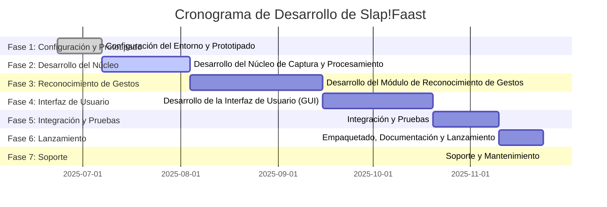

# Plan de Desarrollo y Cronograma para Slap!Faast

## Introducción

Este documento presenta un plan de desarrollo detallado y un cronograma estimado para la creación del software **Slap!Faast**. El plan se divide en fases lógicas, cada una con hitos y tareas específicas, para guiar el proceso de desarrollo desde la configuración inicial hasta el lanzamiento y el soporte post-lanzamiento. El cronograma es una estimación y puede estar sujeto a cambios en función de la complejidad encontrada durante el desarrollo y los recursos disponibles.

## Fases del Desarrollo

El desarrollo de Slap!Faast se dividirá en las siguientes fases:

*   **Fase 1: Configuración del Entorno y Prototipado (2 semanas)**
*   **Fase 2: Desarrollo del Núcleo de Captura y Procesamiento (4 semanas)**
*   **Fase 3: Desarrollo del Módulo de Reconocimiento de Gestos (6 semanas)**
*   **Fase 4: Desarrollo de la Interfaz de Usuario (GUI) (5 semanas)**
*   **Fase 5: Integración y Pruebas (3 semanas)**
*   **Fase 6: Empaquetado, Documentación y Lanzamiento (2 semanas)**
*   **Fase 7: Soporte y Mantenimiento (Continuo)**

### Fase 1: Configuración del Entorno y Prototipado (2 semanas)

*   **Objetivo**: Establecer el entorno de desarrollo, configurar el control de versiones y crear un prototipo básico para validar la comunicación con los sensores Kinect.
*   **Tareas**:
    *   Configurar el repositorio de código (Git).
    *   Establecer el entorno de desarrollo de Python y las dependencias iniciales.
    *   Desarrollar un prototipo simple para conectar y capturar datos de cada modelo de Kinect (v1, v2, Azure Kinect) por separado.
    *   Validar la viabilidad de las librerías seleccionadas (`pykinect`, `PyKinect2`, `pyk4a`) en un entorno de Windows 11.
*   **Hito**: Prototipo funcional que demuestra la captura de datos de los tres modelos de Kinect.

### Fase 2: Desarrollo del Núcleo de Captura y Procesamiento (4 semanas)

*   **Objetivo**: Implementar la capa de abstracción de hardware y los módulos de adquisición de datos y procesamiento de esqueletos.
*   **Tareas**:
    *   Desarrollar la interfaz `IKinectSensor` y las clases de implementación para cada modelo de Kinect.
    *   Implementar la fábrica de sensores (`KinectSensorFactory`) para la detección automática.
    *   Desarrollar el Módulo de Procesamiento de Esqueletos, incluyendo la normalización de datos de joints.
    *   Crear pruebas unitarias para la capa de abstracción y el procesamiento de esqueletos.
*   **Hito**: Un núcleo funcional que puede capturar y procesar datos de esqueleto de manera uniforme desde cualquier Kinect compatible.

### Fase 3: Desarrollo del Módulo de Reconocimiento de Gestos (6 semanas)

*   **Objetivo**: Implementar el motor de reconocimiento de gestos, incluyendo el entrenamiento de gestos personalizados.
*   **Tareas**:
    *   Implementar el algoritmo de reconocimiento de gestos dinámicos (DTW como opción inicial, con posibilidad de expansión a LSTMs).
    *   Desarrollar la lógica para grabar, etiquetar y entrenar gestos personalizados.
    *   Implementar el "modo escucha" y el gesto de activación/desactivación.
    *   Crear un conjunto de gestos predefinidos.
    *   Desarrollar pruebas para el reconocimiento de gestos.
*   **Hito**: Un módulo de reconocimiento de gestos funcional que puede identificar gestos predefinidos y entrenar nuevos gestos personalizados.

### Fase 4: Desarrollo de la Interfaz de Usuario (GUI) (5 semanas)

*   **Objetivo**: Crear una interfaz de usuario intuitiva y funcional para que los usuarios interactúen con Slap!Faast.
*   **Tareas**:
    *   Diseñar y maquetar las diferentes pantallas de la GUI (dashboard, gestión de gestos, mapeo de acciones, configuración).
    *   Implementar la visualización en tiempo real del esqueleto.
    *   Conectar la GUI con los módulos de backend (captura, reconocimiento, configuración).
    *   Desarrollar la interfaz para el entrenamiento y mapeo de gestos.
*   **Hito**: Una GUI completamente funcional que permite al usuario controlar todas las características de Slap!Faast.

### Fase 5: Integración y Pruebas (3 semanas)

*   **Objetivo**: Integrar todos los módulos del software y realizar pruebas exhaustivas para asegurar la estabilidad y el rendimiento.
*   **Tareas**:
    *   Integrar la GUI con el backend y asegurar una comunicación fluida.
    *   Realizar pruebas de integración para verificar que todos los módulos funcionan juntos correctamente.
    *   Realizar pruebas de rendimiento para identificar y solucionar cuellos de botella.
    *   Realizar pruebas de usabilidad con usuarios beta para obtener retroalimentación.
*   **Hito**: Una versión beta estable de Slap!Faast lista para el lanzamiento.

### Fase 6: Empaquetado, Documentación y Lanzamiento (2 semanas)

*   **Objetivo**: Preparar el software para su distribución y lanzamiento público.
*   **Tareas**:
    *   Crear un instalador para Windows que gestione las dependencias (SDKs de Kinect, librerías de Python).
    *   Escribir la documentación de usuario final (guía de instalación, tutorial de uso).
    *   Preparar el sitio web o la página de lanzamiento del proyecto.
    *   Publicar la versión 1.0 de Slap!Faast.
*   **Hito**: Lanzamiento público de Slap!Faast v1.0.

### Fase 7: Soporte y Mantenimiento (Continuo)

*   **Objetivo**: Proporcionar soporte a los usuarios, corregir errores y planificar futuras actualizaciones.
*   **Tareas**:
    *   Monitorear los canales de retroalimentación de los usuarios (foro, correo electrónico, etc.).
    *   Corregir errores y publicar actualizaciones de mantenimiento.
    *   Planificar y desarrollar nuevas características para futuras versiones.
*   **Hito**: Un proyecto mantenido activamente con una comunidad de usuarios satisfecha.

## Cronograma Estimado (Gantt Chart Conceptual)

**Nota**: El cronograma es una estimación y puede variar. Las fechas son ilustrativas y se basan en un inicio del proyecto a finales de junio de 2025.

